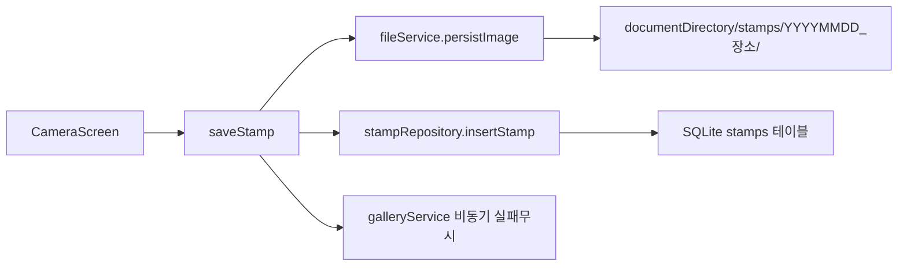
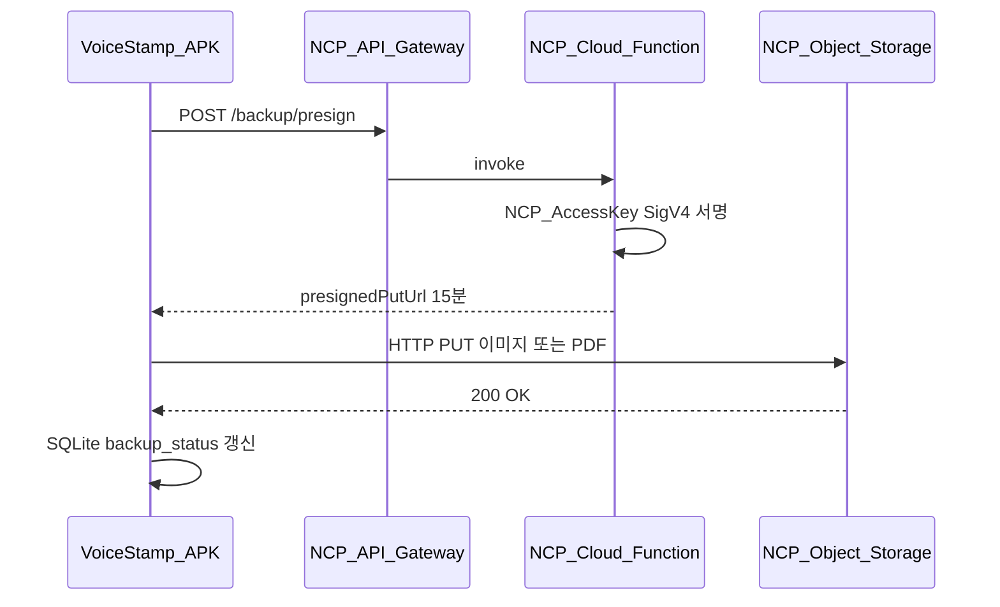
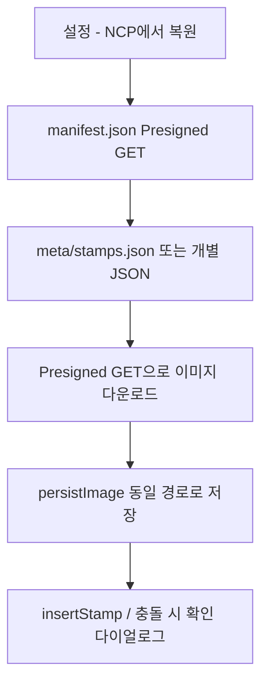

# VoiceStamp 개발 계획 (Plan)

| 항목 | 내용 |
|------|------|
| 문서 버전 | 2.0 |
| 작성일 | 2026-06-14 |
| 기준 커밋 | `69c0b66` (main) |
| 관련 문서 | [PRD.md](./PRD.md), [PROJECT.md](./PROJECT.md) |

---

## 1. 프로젝트 단계 요약

| 단계 | 목표 | 상태 |
|------|------|------|
| **Phase 0** | MVP — 촬영·음성·저장·목록·PDF | ✅ 완료 |
| **Phase 1** | 설정·위치 제목·휴지통·갤러리·웹 배포 | ✅ 완료 |
| **Phase 2** | PDF 고도화·UI/UX·손잡이·내보내기 확장 | ✅ 완료 |
| **Phase 3** | 배포·법무 문서·앱 내 정책 표시 | 🔄 진행 중 (LEG-04 ✅) |
| **Phase 4** | 목적별 UX·보고서 서식·데이터 백업 (**NCP 우선**, §12) | 📋 계획 |

---

## 2. Phase 2 완료 항목 (2026-06-07)

기능 단위 **최소 수정** + `src.pre-*` 백업 + `restore-*.bat` + 커밋·Vercel·APK 재빌드 원칙으로 반영됨.

| # | 기능 | 커밋 | RESTORE |
|---|------|------|---------|
| 31 | 앨범·기본 카메라로 사진 가져오기 | (세션) | §37 |
| 32 | 제목·메모 정렬 설정 | (세션) | §38 |
| 33 | 설정 화면 스크롤 | `c05376a` | §39 |
| 34 | PDF 사진·텍스트 정렬 맞춤 | `a32eff6` | §40 |
| 35 | PDF 이미지 크기 확대 | `354a942` | §41 |
| 36 | PDF 일시·파일명·빈 메모 처리 | `6989370` | §42 |
| 37 | PDF 1페이지 보고서 제목 | `ab897ba` | §43 |
| 38 | 카메라·목록 메뉴 재배치 | `ecf2823` | §44 |
| 39 | 카메라 메뉴 하단 코너 배치 | `c7d4925` | §45 |
| 40 | 손잡이(왼손/오른손) 카메라 메뉴 | `111bc3c` | §46 |
| 41 | 손잡이에 따른 마이크 버튼 위치 | `86e06e5` | §47 |
| 42 | 마이크 PNG 아이콘 | `5c7b1de` | §48 |
| 43 | 녹음 중 점(●) 표시 | `4d4e68b` | §49 |
| 44 | 목록·설정·카메라 메뉴 타원 크기 통일 | `b0086c0` | §50 |
| 45 | 선택 스탬프 합성 JPEG 갤러리 저장 | `db111b3` | §51 |
| 46 | 갤러리 앨범 분류 실패 시 성공 처리 | `e4eada2` | §52 |
| 47 | 제목·메모 별도 영역 / 워터마크 | `539c4c4` | §53 |
| 48 | PDF·이미지 공통 파일명 | `31332dc` | §54 |
| 49 | Android 뒤로가기 (종료 확인·화면 복귀) | `3b6201a` | §55 |
| 50 | 3D 액자 앱 아이콘 | `565e4b3` | §8 |
| 51 | Vercel `.vercelignore` | `919dbf2` | — |
| 52 | 아이콘 Adaptive Icon safe zone 여백 | `591666e` | §8 |
| 53 | APK 마이크 권한(RECORD_AUDIO) 복구 | `b222581` | §56 |
| 54 | 현장명·날짜별 앱 폴더·갤러리 앨범 분류 | `9ae5725` | §57 |
| 55 | 현장명 입력을 저장 모달로 이동 | `ebda9cc` | §58 |
| 56 | 갤러리 앨범 분류 (legacy initialAsset) | `bbec4aa` | §59 |
| 57 | 갤러리 앨범 (MediaLibrary Next + 읽기 권한) | `204ba88` | §60 |
| 58 | 갤러리 앨범 (쓰기 전용 + 앨범 ID 캐시) | `3076dc6` | §61 |
| 59 | 저장 모달 장소명 라벨 문구 변경 | `3b88fe9` | §62 |
| 60 | 저장·수정 모달 사진 전체 보기 | `27e5f6e` | §63 |
| 61 | 전체 보기에서 사진 버리기·휴지통 이동 | `cd7ed89` | §64 |
| 62 | 수정 화면 저장 폴더 표시·갤러리 앨범 이동 | `2f2385b` | §65 |
| 63 | 수정 화면 저장 폴더 선택 모달 | `6baa947` | §66 |

## 2A. Phase 2 추가 완료 (2026-06-09)

| # | 기능 | 커밋 | RESTORE |
|---|------|------|---------|
| 64 | 신규 저장 시 `YYYYMMDD_장소명` 폴더명 자동 채움·기존 폴더 선택 | `a3d4351` | `restore-site-group-full.bat` §64 |
| 65 | 웹 크래시 수정 (`galleryService.web.ts` 스텁) | `59c7007` | `restore-gallery-web-stub.bat` §65 |
| 66 | 목록 선택 휴지통 후 스크롤 유지 (1차: silent load) | `eef0891` | — |
| 67 | 목록 휴지통 후 스크롤 (skipRefresh·scrollToOffset) | `5831512` | `restore-list-trash-scroll.bat` §66 |
| 68 | 목록 휴지통 스크롤 앵커 인덱스 (시도) | `6cf82f5` | — |
| 69 | 앵커 인덱스 되돌림 (앱 종료 방지) | `953c2cd` | — |
| 70 | 카메라→목록 재진입 무한 로딩 수정 | `bfb77d8` | `restore-list-silent-loading.bat` §67 |
| 71 | 수정 모달 휴지통 후 목록 스크롤 유지 | `b44c469` | `restore-edit-trash-scroll.bat` §68 |
| 72 | 목록 헤더 「설정」·설정 복귀(목록/카메라) | `a4a55d2` | `restore-info-leg04.bat` §69 |
| 73 | LEG-04 앱 정보·정책 웹 (`public/*.html`) | `a4a55d2` | `restore-info-leg04.bat` §69 |
| 74 | 저장 폴더 기본 현장명 유지 (GPS→제목만) | `4f56b07` | `restore-site-folder-keep.bat` §70 |
| 75 | `/info` GitHub APK 다운로드 링크 | `3468630` | `restore-apk-download.bat` |

## 2B. Phase 2 추가 완료 (2026-06-11)

| # | 기능 | 커밋 | RESTORE |
|---|------|------|---------|
| 76 | 시스템 카메라 자동 실행 (줌 지원, CameraView 제거) | `be8bd93` | `restore-system-camera-auto.bat` |
| 77 | 워터마크 JPEG 비율 보존 (aspectRatio·onLoadEnd) | `3306c3d` | `restore-watermark-aspect.bat` |
| 78 | 워터마크 픽셀 준비 + ViewShot (`prepareExportPhoto`) | `ef71f5a` | `restore-watermark-pixel.bat` |
| 79 | 워터마크 네이티브 텍스트 합성 (`react-native-image-marker`) | `f61697d` | `restore-watermark-native.bat` |
| 80 | 저장 시 갤러리 모드 (원본만 / 캡션만 / 원본+캡션) | `6948a96` | `restore-gallery-save-mode.bat` |
| 81 | 학교 POI 우선 위치 제목 | `4b4d25d` | `restore-school-poi.bat` §71 |
| 82 | 온보딩 인트로 (최초 실행) | `784c163` | `restore-intro.bat` §72 |
| 83 | 온보딩 4단계 슬라이드 | `db81ef9` | `restore-intro-4.bat` §73 |
| 84 | 온보딩 반응형 레이아웃 | `73ee56f` | `restore-intro-layout.bat` §74 |
| 85 | 온보딩 이미지 갱신 (버튼 제거판) | `fac7734` | `restore-onboarding-images.bat` §75 |

## 2C. Phase 2 추가 완료 (2026-06-12)

| # | 기능 | 커밋 | RESTORE |
|---|------|------|---------|
| 86 | 온보딩 30일 미사용 시 재표시 | `c92ed84` | `restore-onboarding-30d.bat` §76 |
| 87 | 설정 → 온보딩 다시 보기 | `84a2447` | `restore-onboarding-replay.bat` §77 |
| 88 | 캡션·워터마크 네이티브 레이아웃 | `2844213` | `restore-caption-native.bat` §78 |
| 89 | 캡션 흰 여백·PNG 내보내기 | `5b1e3f4` | `restore-caption-white-png.bat` §79 |
| 90 | 갤러리 한글 파일명 (시도 후 되돌림) | `69a2246`, `023118d` | — |

## 2D. Phase 2 추가 완료 (2026-06-13)

| # | 기능 | 커밋 | RESTORE |
|---|------|------|---------|
| 91 | GPS 좌표 캡션·워터마크·PDF | `2196ece` | `restore-gps-caption.bat` §80 |
| 92 | 저장 모달 제목·메모 미리보기 | `3ece91f` | `restore-save-preview-text.bat` §81 |
| 93 | 전체 화면 핀치 줌·이동 | `8e269a8`, `00a521d` | `restore-save-zoom.bat` §82 |
| 94 | 크롭 적용 vs 닫기·`_orig` 보존 | `4a85cc8`, `ece0865` | `restore-save-viewer-actions.bat` §87 |
| 95 | 저장 후 갤러리 백그라운드 | `fc2423d` | `restore-save-fast-gallery.bat` §89 |
| 96 | 마이크 `(눌러서 말하기)` | `01f0f9e` | `restore-mic-hint.bat` §88 |
| 97 | 수정 모달 크롭·적용 | `7d908fd` | `restore-edit-crop.bat` §90 |
| 98 | 목록 PDF·이미지 내보내기 안내 | `fbcc872` | `restore-list-export-hint.bat` §91 |
| 99 | Intro 후 StartScreen (`start.png`, 7일 숨김) | `56898a7` | `restore-start-screen.bat` §92 |
| 100 | GitHub APK `releases/VoiceStamp_20260613_114227.apk` | `b697025` | — |
| 101 | 웹 브라우저 카메라 (Vercel) | `9260376` | `restore-web-camera.bat` §93 |

## 2E. Phase 2 추가 완료 (2026-06-13 후반 ~ 2026-06-14)

| # | 기능 | 커밋 | RESTORE |
|---|------|------|---------|
| 102 | 학교 층 선택 (1~5, `school_only` 기본) | `f4201a7` | — |
| 103 | GitHub APK `releases/VoiceStamp_20260613_234943.apk` | `484ac4c` | — |
| 104 | PLAN §12 NCP Object Storage 백업 설계 (문서) | `b646e84` | — |
| 105 | GPS 조회 전 300m 이전 `placeLabel` 즉시 표시 | `e7e6147` | `restore-location-place-cache.bat` §94 |
| 106 | 좌표 표기 설정 (`coords_label`) | `f36601e` | `restore-coords-label.bat` §95 |
| 107 | 음성 입력 커서 위치 삽입 | `fb053f7` | `restore-speech-cursor.bat` §96 |
| 108 | 저장 모달 하단 취소·저장 고정 | `6b6e70a` | `restore-save-modal-footer.bat` §97 |
| 109 | 저장 모달 Android 내비 바 여백 | `4912535` | `restore-save-modal-nav-padding.bat` §98 |
| 110 | 저장 모달 720px 미리보기 썸네일 | `41dce4f` | `restore-save-preview-thumb.bat` §99 |
| 111 | Android 미리보기 URI 정규화 | `3cc3845` | `restore-save-preview-android-fix.bat` §100 |
| 112 | 워터마크 미리보기 180px (시도, 미해결) | `b72f0a2` | `restore-watermark-preview-layout.bat` §101 |
| 113 | 워터마크 미리보기 absoluteFill (시도, 미해결) | `19684c5` | `restore-watermark-preview-v2.bat` §102 |
| 114 | 워터마크 미리보기 캡션 슬롯 (**Android 해결**) | `69c0b66` | `restore-watermark-preview-caption-slot.bat` §103 |

### 2.1 문서 동기화 이력

| 커밋 | 내용 |
|------|------|
| `f125897` | PRD·PROJECT·PLAN·PRIVACY·LICENSE 문서 정리 (기준 `539c4c4`) |
| `470606d` | PRD·PROJECT·PLAN 문서 정리 (기준 `31332dc`) |
| `ffa77bf` | PRD·PROJECT·PLAN·RESTORE 문서 정리 (기준 `3b6201a`) |
| `3eb9fd9` | PRD·PROJECT·PLAN·RESTORE 문서 정리 (기준 `591666e`) |
| `36361b4` | PRD·PROJECT·PLAN·README 문서 정리 (기준 `b222581`) |
| `cc5c3f1` | PRD·PROJECT·PLAN·README 문서 정리 (기준 `6baa947`) |
| `89a9ee2` | PRD·PROJECT·PLAN·README 문서 정리 (기준 `b44c469`) |
| `453e160` | PRD·PROJECT·PLAN·README 문서 정리 (기준 `a4a55d2`) |
| `876f390` | PRD·PROJECT·PLAN·README 문서 정리 (기준 `4f56b07`) |
| `a45a750` | PRD·PROJECT·PLAN·README 문서 정리 (기준 `0970d3d`) |
| (본 갱신) | `182f4e7` 반영 — 학교 POI·온보딩 4단계·반응형·이미지 갱신·APK별·날짜별 이력 |
| (본 갱신) | `9260376` 반영 — Phase 2C/2D·크롭·start·웹 카메라·APK `114227`·날짜별 이력 |
| (본 갱신) | §12 로컬 저장 + **NCP Object Storage** 백업 설계 추가 (`FEAT-03-NCP`) |
| (본 갱신) | `69c0b66` 반영 — 층·좌표·커서·저장 모달 UX·워터마크 미리보기·APK·날짜별 이력 |

---

## 3. Phase 3 — 배포·법무 (진행 중)

| ID | 작업 | 우선순위 | 상태 |
|----|------|----------|------|
| DEP-01 | 3D 액자 앱 아이콘 (`assets` 5종) | P1 | ✅ `565e4b3` |
| DEP-02 | Adaptive Icon safe zone 여백 | P1 | ✅ `591666e` |
| DEP-03 | Vercel `.vercelignore` | P2 | ✅ `919dbf2` |
| LEG-01 | LICENSE 저작권 (이형우, MIT + OSS 고지) | P1 | ✅ 커밋됨 (`f125897`) |
| LEG-02 | [PRIVACY.md](./PRIVACY.md) 개인정보 처리 안내 | P1 | ✅ 커밋됨 |
| LEG-03 | [KAKAO-KEY-SECURITY.md](./KAKAO-KEY-SECURITY.md) | P1 | ✅ 커밋됨 |
| LEG-04 | 버전·라이선스·개인정보·도움말 (설정 앱 정보 + 웹 `/privacy` 등) | P2 | ✅ `a4a55d2` |
| LEG-05 | Play 스토어 등록용 스크린샷·스토어 문구 | P3 | 📋 미구현 (정책 URL: `/privacy` 준비됨) |
| DEP-04 | `/info` GitHub Releases APK 다운로드 링크 | P2 | ✅ `3468630` |

> **참고:** APK/Web만 배포할 때는 문서(`docs/`)만으로도 내부·테스터 배포는 가능. 스토어 등록 시 LEG-04·05 권장.

---

## 4. Phase 4 — 후보 기능 (미구현)

PRD §10.1 및 기획 메모(`최소수정.txt`)에서 도출.

### 4.1 UX·콘텐츠

| ID | 내용 | 비고 |
|----|------|------|
| UX-C | 구·동 먼저 표시, 건물명은 나중 추가 | `kakaoLocal.ts` |
| UX-D2 | 위치 실패 시 짧은 안내 문구 | 선택 |
| UX-PURPOSE | **사진 목적별** 제목·메모 라벨 (여행→이야기, 점검→결과 등) | 설정 또는 프로필 |
| FEAT-02 | PDF 생성 진행 표시 UI | |

### 4.2 데이터·복구

| ID | 내용 | 비고 |
|----|------|------|
| FEAT-03 | DB+메타데이터 내보내기/가져오기 | 재설치 복구 |
| **FEAT-03-NCP** | **NCP Object Storage 백업·복원** (이미지+메타+PDF) | **§12 설계 완료**, 구현 대기 |
| FEAT-03b | 갤러리 사진 ↔ SQLite 메타 연동 | Out of Scope에 가까움 |

### 4.3 보고서·서식 (장기)

| ID | 내용 | 비고 |
|----|------|------|
| RPT-01 | HTML/PDF **서식 템플릿** 선택·업로드 | 점검 보고서 등 |
| RPT-02 | xlsx 다중 이미지 POC | exceljs |
| RPT-03 | hwpx POC | 범위 조정 가능 |

---

## 5. 개발 원칙 (유지)

1. **최소 수정** — 요청 범위만 변경, 기존 구조·패턴 유지  
2. **되돌리기** — `src.pre-<feature>/` + `restore-<feature>.bat` + `RESTORE.md` § 추가  
3. **검증** — 커밋 → `git push` → Vercel `--prod` → `build-apk.bat` (날짜·시간 APK)  
4. **문서** — 기능 완료 시 PRD·PROJECT·본 PLAN 갱신  
5. **Expo SDK 56** — [공식 문서](https://docs.expo.dev/versions/v56.0.0/) 기준

---

## 6. 다음 권장 작업 순서

| 순서 | 작업 | 이유 |
|------|------|------|
| 1 | LEG-05 Play 스토어 스크린샷·등록 | 정책 URL 준비됨 |
| 2 | UX-D2 위치 실패 안내 | 작은 diff, 체감 개선 |
| 3 | FEAT-02 PDF 진행 표시 | 다장 PDF 시 UX |
| 4 | UX-PURPOSE 목적별 필드 라벨 | 기획 메모 반영 |
| 5 | FEAT-03 로컬 JSON 백업/복원 | 재설치 시나리오 (오프라인) |
| 5b | **FEAT-03-NCP** NCP 백업/복원 | §12 설계 기준, NCP 인프라 선행 |
| 6 | RPT-01 보고서 서식 | 별도 PDCA·POC 필요 |

---

## 7. 배포·아티팩트 (현재)

| 항목 | 값 |
|------|-----|
| GitHub | https://github.com/golee75git/VoiceStamp (`main`) |
| Vercel | https://voicestamp-gilt.vercel.app |
| 최신 APK (문서 기준) | `VoiceStamp_20260614_110346.apk` (`69c0b66`, 로컬) |
| GitHub APK | `releases/VoiceStamp_20260613_234943.apk` (`484ac4c`) |
| 최신 소스 | `69c0b66` — 웹·APK 동기화 (워터마크 미리보기 포함) |
| APK 다운로드 (웹) | https://voicestamp-gilt.vercel.app/info → GitHub Releases |
| 정책 URL | https://voicestamp-gilt.vercel.app/privacy |
| Android 패키지 | `com.voicestamp.app` |

---

## 8. 문서 갱신 규칙

| 이벤트 | 갱신 대상 |
|--------|-----------|
| 기능 추가·변경 | PRD §3, PROJECT §4, PLAN §2·§4, RESTORE § |
| 배포 | PROJECT §7, PLAN §7, PRD 헤더 커밋 해시 |
| 법무·정책 | PRIVACY, LICENSE, PLAN §3 |
| 분기 점검 | 본 문서 §6 우선순위 재검토 |

---

## 9. 관련 문서

| 문서 | 설명 |
|------|------|
| [PRD.md](./PRD.md) | 요구사항·기능 ID |
| [PROJECT.md](./PROJECT.md) | 구현 이력·모듈·커밋 |
| [README.md](./README.md) | docs 목록 |
| [../RESTORE.md](../RESTORE.md) | 되돌리기 §1~103 |
| [DESIGN-INFO-PAGES.md](./DESIGN-INFO-PAGES.md) | 정보·정책 페이지 설계·구현 (`a4a55d2`) |
| NCP-KEY-SECURITY.md (예정) | NCP API 인증키·Presigned URL 보안 체크리스트 |

---

## 10. 날짜별 개발 요약

| 날짜 | Phase | 요약 |
|------|-------|------|
| 2026-06-05 | 0 | Git 저장소 생성 |
| 2026-06-06 | 0→1 | MVP·PDF·웹·설정·위치·휴지통·갤러리·APK 파이프라인 |
| 2026-06-07 | 2 | PDF/JPEG보내기·UI·손잡이·Android 뒤로·아이콘·권한 |
| 2026-06-08 | 2→3 | 장소·폴더·갤러리 앨범·수정 UX·폴더 선택·문서 동기화 |
| 2026-06-09 | 2→3 | 폴더 자동 채움·웹 스텁·목록 스크롤·**LEG-04·목록 설정** |
| 2026-06-10 | 3 | **저장 폴더 현장명 유지**·`/info` APK 링크·문서 동기화 |
| 2026-06-11 | 2→3 | **시스템 카메라**(줌)·워터마크 JPEG·**저장 시 갤러리 모드**·**학교 POI 위치**·**4단계 온보딩** |
| 2026-06-12 | 2C | **캡션 네이티브**·흰 여백 PNG·온보딩 30일·설정 재생 |
| 2026-06-13 | 2D | **GPS**·저장 미리보기·**줌/크롭**·갤러리 백그라운드·start·**웹 카메라**·**층 선택** |
| 2026-06-14 | 2E | **이전 장소 캐시**·**좌표 표기**·음성 커서·저장 모달 UX·**워터마크 미리보기 수정** |
| 2026-06-14 | 4 (설계) | **§12 NCP 백업** 아키텍처 문서화 (`FEAT-03-NCP`, `b646e84`) |

---

## 11. APK 빌드별 요약

| APK (권장) | 커밋 | 한 줄 |
|------------|------|--------|
| `VoiceStamp_20260614_110346.apk` | `69c0b66` | **설치 권장** — 워터마크 미리보기·층·좌표·커서·하단 버튼 |
| `VoiceStamp_20260614_105426.apk` | `19684c5` | 워터마크 미리보기 v2 (미해결) |
| `VoiceStamp_20260614_102657.apk` | `41dce4f` | 720px 미리보기 썸네일 |
| `releases/VoiceStamp_20260613_234943.apk` | `484ac4c` | **GitHub 최신** — 층 선택 |
| `releases/VoiceStamp_20260613_114227.apk` | `b697025` | start·크롭·GPS |
| `VoiceStamp_20260611_232649.apk` | `182f4e7` | 온보딩 4단계·반응형·이미지 갱신 |
| `VoiceStamp_20260611_222640.apk` | `e14950a` | 학교 POI 우선 위치 제목 |
| `VoiceStamp_20260611_184601.apk` | `0970d3d` | 저장 시 갤러리 원본/캡션/둘 다 |
| `VoiceStamp_20260611_182919.apk` | `f61697d` | 워터마크 네이티브 합성 |
| `VoiceStamp_20260611_172409.apk` | `be8bd93` | 시스템 카메라 (줌) |
| `VoiceStamp_20260610_233157.apk` | `4f56b07` | 저장 폴더 현장명 유지 |
| `VoiceStamp_20260609_183510.apk` | `a4a55d2` | 설정·앱 정보·정책 웹 |
| `VoiceStamp_20260609_181249.apk` | `b44c469` | 수정 휴지통 스크롤 |
| `VoiceStamp_20260609_173859.apk` | `6cf82f5` | **배포 금지** |
| `VoiceStamp_20260608_235051.apk` | `6baa947` | 폴더 선택 모달 |
| `VoiceStamp_20260607_145955.apk` | `3b6201a` | Android 뒤로가기 |

전체: [PROJECT.md](./PROJECT.md) §7.4 · [PRD.md](./PRD.md) §13

---

## 12. 로컬 저장 + NCP 백업 설계 (`FEAT-03-NCP`)

> **상태:** 설계 문서만 반영 (소스 미구현). 클라우드 스택은 **네이버 클라우드 플랫폼(NCP) 우선**. Vercel Serverless는 대안으로만 고려.

### 12.1 배경·목표

#### 현재 저장 구조



| 계층 | 구현 | 한계 |
|------|------|------|
| 로컬 1차 | `saveStamp` → `persistImage` → `stamps/{groupName}/{title}_{id}.jpg` | 앱 삭제 시 소실 |
| 메타 | SQLite `stamps` (제목·메모·GPS·층 등) | 갤러리에 없음 |
| 갤러리 | `scheduleNewStampGallerySave` (비동기·비치명적) | **사진만** 백업, 메타·PDF 없음 |

**목표:** 로컬 저장을 **그대로 유지**하면서, 사용자가 선택 시 **NCP Object Storage**에 이미지·메타 JSON·PDF를 백업·복원한다.

### 12.2 NCP 우선 아키텍처



| NCP 서비스 | 역할 |
|-----------|------|
| **Object Storage** (`kr-standard`, `https://kr.object.ncloudstorage.com`) | 이미지·PDF·manifest JSON 저장 (S3 호환 API) |
| **API Gateway** | HTTPS 엔드포인트, rate limit |
| **Cloud Functions** (Node.js) | Presigned URL 발급, manifest 조회, 삭제 |
| **Sub Account** + API 인증키 | Cloud Functions 환경변수에만 보관 |
| Cloud Log Analytics (선택) | 업로드 실패·403 모니터링 |

> **대안:** Presigned URL 발급을 Vercel Serverless로 둘 수 있으나, 스토리지·API를 NCP에 통일하는 것을 **기본안**으로 한다.

**공식 문서:** [Object Storage API](https://api.ncloud-docs.com/docs/storage-objectstorage) · [Object Storage 제품](https://www.ncloud.com/product/storage/objectStorage)

### 12.3 보안 원칙

[KAKAO-KEY-SECURITY.md](./KAKAO-KEY-SECURITY.md)와 동일한 패턴:

| 항목 | 규칙 |
|------|------|
| NCP Access Key / Secret Key | **NCP Cloud Functions 환경변수만**, git·앱 번들 금지 |
| 앱에 노출 가능 | `EXPO_PUBLIC_NCP_BACKUP_API_URL` (API Gateway URL) |
| 업로드 방식 | **Presigned URL** — 앱이 Object Storage에 직접 PUT |
| 버킷 ACL | **Private** 기본, 조회·복원은 Presigned GET |
| 구현 시 법무 | [PRIVACY.md](./PRIVACY.md) §3「클라우드 백업 옵션」문구 추가 |

### 12.4 사용자 인증 (로그인 없음)

현재 앱에 계정 로그인이 없으므로 v1은 **기기 단위** 식별:

| 항목 | 방식 |
|------|------|
| 기기 식별 | 최초 실행 시 `deviceId` (UUID) → SQLite `app_settings` |
| 백업 경로 prefix | `voicestamp/{deviceId}/` |
| 복원 | 동일 `deviceId` + (선택) **복원 PIN** 4~6자리 (API Gateway에서 검증) |
| 멀티 기기 | v1: PIN 공유 + 수동 복원 / v2: 계정 로그인 검토 |

### 12.5 NCP 버킷·오브젝트 키 규칙

로컬 `fileService` 경로와 **1:1 대응** (`groupName`, 파일명 재사용):

```
버킷: voicestamp-backup (예시, Private)

voicestamp/{deviceId}/
  stamps/{groupName}/
    {title}_{shortId}.jpg
    {title}_{shortId}_orig.jpg     # 크롭 전 원본 (있을 때)
  meta/
    stamps.json                    # 전체 메타 스냅샷
    stamps/{stampId}.json          # 개별 메타 (증분 백업)
  pdf/
    {reportTitle}_{timestamp}.pdf  # 목록 PDF보내기 (설정 ON 시)
  manifest.json                    # 마지막 백업 시각·버전·체크섬
```

**Content-Type:**

| 파일 | Content-Type |
|------|--------------|
| JPEG | `image/jpeg` |
| PNG | `image/png` |
| PDF | `application/pdf` |
| JSON | `application/json` |

### 12.6 백업 트리거·동작

| 시점 | 업로드 대상 | 우선순위 |
|------|------------|----------|
| 스탬프 저장 직후 | 메인 JPG + `meta/stamps/{id}.json` | P0 |
| 수정·크롭 후 | 변경 JPG + 메타 갱신 | P0 |
| 휴지통 이동/복원 | 메타 + (선택) 오브젝트 삭제 마킹 | P1 |
| 목록 PDF 생성 | `pdf/*.pdf` (설정 ON) | P2 |
| 설정「지금 백업」 | `meta/stamps.json` + 미동기화 파일 일괄 | P1 |
| Wi-Fi 전용 (설정) | 위와 동일, 셀룰러 차단 | P2 |

**실패 처리:** 갤러리 백업과 동일 — 로컬 저장 성공 후 **비동기·비치명적** (`scheduleNewStampGallerySave` 패턴). SQLite에 `backup_status: pending | synced | failed` 로 재시도 큐 관리.

### 12.7 NCP Cloud Function API 스펙 (초안)

| Method | Path | 요청 body / query | 응답 |
|--------|------|-------------------|------|
| POST | `/backup/presign` | `{ deviceId, objectKey, contentType, pin? }` | `{ putUrl, expiresIn }` |
| POST | `/backup/presign-get` | `{ deviceId, objectKey, pin? }` | `{ getUrl, expiresIn }` |
| GET | `/backup/manifest` | `?deviceId=` | `{ lastBackupAt, objects[] }` |
| DELETE | `/backup/object` | `{ deviceId, objectKey }` | `{ ok }` |

**Cloud Function SDK:** `@aws-sdk/client-s3`, `@aws-sdk/s3-request-presigner`  
- endpoint: `https://kr.object.ncloudstorage.com`  
- region: `kr-standard`

### 12.8 앱 측 구현 참고 (미구현)

| 파일 (예정) | 역할 |
|-------------|------|
| `src/services/ncpBackupService.ts` | presign 요청, PUT 업로드, 상태 갱신 |
| `src/services/backupQueue.ts` | 오프라인·실패 재시도 |
| `src/db/schema.ts` | `cloud_object_key`, `backup_status`, `backed_up_at` 컬럼 추가 |
| `src/types/stamp.ts` | Stamp 타입 확장 |
| 설정 화면 | NCP 백업 ON/OFF, Wi-Fi only, 수동 백업, 마지막 동기화 시각 |

**업로드 예시 (Expo):**

```typescript
const { putUrl, objectKey } = await fetch(NCP_API + '/backup/presign', {
  method: 'POST',
  headers: { 'Content-Type': 'application/json' },
  body: JSON.stringify({ deviceId, objectKey, contentType: 'image/jpeg' }),
}).then((r) => r.json());

await FileSystem.uploadAsync(putUrl, localUri, {
  httpMethod: 'PUT',
  headers: { 'Content-Type': 'image/jpeg' },
});
```

### 12.9 복원 플로우



| 정책 | 내용 |
|------|------|
| 충돌 | `id` 동일 + 클라우드 `updatedAt`이 더 최신 → 덮어쓰기 확인 |
| 병행 | FEAT-03 로컬 JSON export = 오프라인/USB, NCP = 원격 백업 |

### 12.10 NCP 콘솔 설정 체크리스트

- [ ] Object Storage 버킷 생성 (Private, `kr-standard`)
- [ ] Sub Account 생성 → Object Storage 읽기/쓰기 권한만 부여
- [ ] API Gateway + Cloud Functions 연결 (환경변수에 Access Key)
- [ ] CORS: APK는 직접 PUT으로 불필요; **웹 백업** 시 Vercel origin 추가
- [ ] (선택) Lifecycle: 90일 미접근 → 저비용 스토리지 클래스
- [ ] 비용: 저장 GB + PUT/GET 요청 수 (소규모 팀 수 GB 수준 예상)

### 12.11 구현 단계 (PDCA)

| 단계 | 작업 | 산출물 |
|------|------|--------|
| P0 문서 | 본 §12 | PLAN.md (완료) |
| P1 인프라 | NCP 버킷·Function·Gateway | `docs/NCP-BACKUP-SETUP.md` (별도) |
| P2 앱 | presign + PUT + DB 컬럼 | `ncpBackupService.ts` |
| P3 UX | 설정 토글·수동 백업·상태 표시 | 설정 화면 |
| P4 복원 | manifest 기반 가져오기 | 복원 마법사 |
| P5 법무 | PRIVACY.md §3·§4, `NCP-KEY-SECURITY.md` | 정책 웹 반영 |
