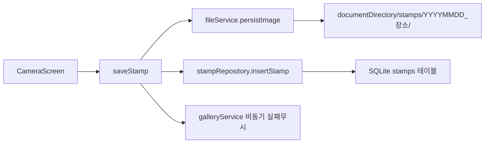
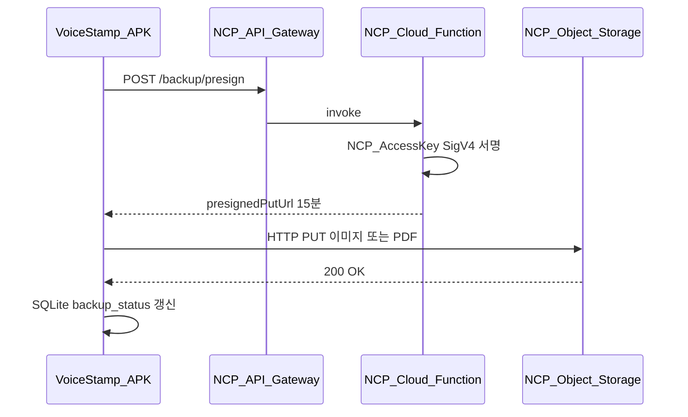
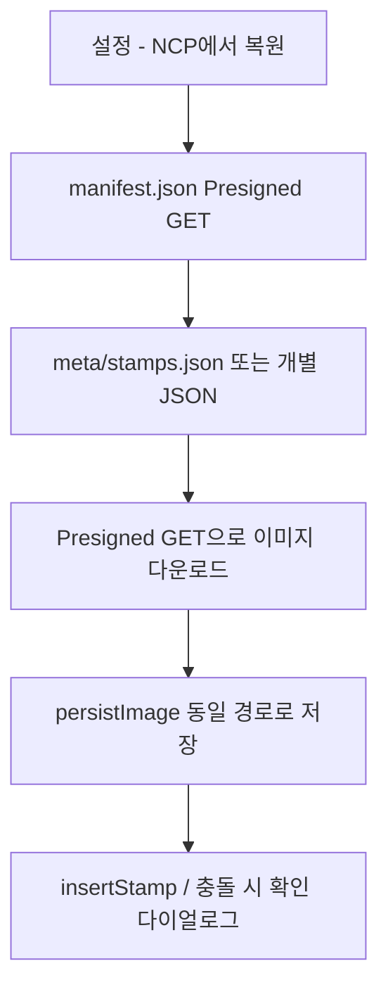

# VoiceStamp 개발 계획 (Plan)

| 항목 | 내용 |
|------|------|
| 문서 버전 | 3.0 |
| 작성일 | 2026-07-06 |
| 기준 커밋 | `f6d33fd` (main) |
| 관련 문서 | [PRD.md](./PRD.md), [PROJECT.md](./PROJECT.md) |

---

## 1. 프로젝트 단계 요약

| 단계 | 목표 | 상태 |
|------|------|------|
| **Phase 0** | MVP — 촬영·음성·저장·목록·PDF | ✅ 완료 |
| **Phase 1** | 설정·위치 제목·휴지통·갤러리·웹 배포 | ✅ 완료 |
| **Phase 2** | PDF 고도화·UI/UX·손잡이·내보내기 확장 | ✅ 완료 |
| **Phase 3** | 배포·법무 문서·앱 내 정책 표시 | 🔄 진행 중 (LEG-04 ✅ LEG-06 ✅) |
| **Phase 4** | 목적별 UX·보고서 서식·데이터 백업 (**NCP 우선**, §12) | 📋 계획 |

---

## 2. Phase 2 완료 항목 (2026-06-07)

기능 단위 **최소 수정** + `src.pre-*` 백업 + `restore-*.bat` + 커밋·Vercel·APK 재빌드 원칙으로 반영됨.

| # | 기능 | 커밋 | RESTORE |
|---|------|------|---------|
| 31 | 앨범·기본 카메라로 사진 가져오기 | (세션) | §37 |
| 32 | 제목·메모 정렬 설정 | (세션) | §38 |
| 33 | 설정 화면 스크롤 | `c05376a` | §39 |
| 34 | PDF 사진·텍스트 정렬 맞춤 | `a32eff6` | §40 |
| 35 | PDF 이미지 크기 확대 | `354a942` | §41 |
| 36 | PDF 일시·파일명·빈 메모 처리 | `6989370` | §42 |
| 37 | PDF 1페이지 보고서 제목 | `ab897ba` | §43 |
| 38 | 카메라·목록 메뉴 재배치 | `ecf2823` | §44 |
| 39 | 카메라 메뉴 하단 코너 배치 | `c7d4925` | §45 |
| 40 | 손잡이(왼손/오른손) 카메라 메뉴 | `111bc3c` | §46 |
| 41 | 손잡이에 따른 마이크 버튼 위치 | `86e06e5` | §47 |
| 42 | 마이크 PNG 아이콘 | `5c7b1de` | §48 |
| 43 | 녹음 중 점(●) 표시 | `4d4e68b` | §49 |
| 44 | 목록·설정·카메라 메뉴 타원 크기 통일 | `b0086c0` | §50 |
| 45 | 선택 스탬프 합성 JPEG 갤러리 저장 | `db111b3` | §51 |
| 46 | 갤러리 앨범 분류 실패 시 성공 처리 | `e4eada2` | §52 |
| 47 | 제목·메모 별도 영역 / 워터마크 | `539c4c4` | §53 |
| 48 | PDF·이미지 공통 파일명 | `31332dc` | §54 |
| 49 | Android 뒤로가기 (종료 확인·화면 복귀) | `3b6201a` | §55 |
| 50 | 3D 액자 앱 아이콘 | `565e4b3` | §8 |
| 51 | Vercel `.vercelignore` | `919dbf2` | — |
| 52 | 아이콘 Adaptive Icon safe zone 여백 | `591666e` | §8 |
| 53 | APK 마이크 권한(RECORD_AUDIO) 복구 | `b222581` | §56 |
| 54 | 현장명·날짜별 앱 폴더·갤러리 앨범 분류 | `9ae5725` | §57 |
| 55 | 현장명 입력을 저장 모달로 이동 | `ebda9cc` | §58 |
| 56 | 갤러리 앨범 분류 (legacy initialAsset) | `bbec4aa` | §59 |
| 57 | 갤러리 앨범 (MediaLibrary Next + 읽기 권한) | `204ba88` | §60 |
| 58 | 갤러리 앨범 (쓰기 전용 + 앨범 ID 캐시) | `3076dc6` | §61 |
| 59 | 저장 모달 장소명 라벨 문구 변경 | `3b88fe9` | §62 |
| 60 | 저장·수정 모달 사진 전체 보기 | `27e5f6e` | §63 |
| 61 | 전체 보기에서 사진 버리기·휴지통 이동 | `cd7ed89` | §64 |
| 62 | 수정 화면 저장 폴더 표시·갤러리 앨범 이동 | `2f2385b` | §65 |
| 63 | 수정 화면 저장 폴더 선택 모달 | `6baa947` | §66 |

## 2A. Phase 2 추가 완료 (2026-06-09)

| # | 기능 | 커밋 | RESTORE |
|---|------|------|---------|
| 64 | 신규 저장 시 `YYYYMMDD_장소명` 폴더명 자동 채움·기존 폴더 선택 | `a3d4351` | `restore-site-group-full.bat` §64 |
| 65 | 웹 크래시 수정 (`galleryService.web.ts` 스텁) | `59c7007` | `restore-gallery-web-stub.bat` §65 |
| 66 | 목록 선택 휴지통 후 스크롤 유지 (1차: silent load) | `eef0891` | — |
| 67 | 목록 휴지통 후 스크롤 (skipRefresh·scrollToOffset) | `5831512` | `restore-list-trash-scroll.bat` §66 |
| 68 | 목록 휴지통 스크롤 앵커 인덱스 (시도) | `6cf82f5` | — |
| 69 | 앵커 인덱스 되돌림 (앱 종료 방지) | `953c2cd` | — |
| 70 | 카메라→목록 재진입 무한 로딩 수정 | `bfb77d8` | `restore-list-silent-loading.bat` §67 |
| 71 | 수정 모달 휴지통 후 목록 스크롤 유지 | `b44c469` | `restore-edit-trash-scroll.bat` §68 |
| 72 | 목록 헤더 「설정」·설정 복귀(목록/카메라) | `a4a55d2` | `restore-info-leg04.bat` §69 |
| 73 | LEG-04 앱 정보·정책 웹 (`public/*.html`) | `a4a55d2` | `restore-info-leg04.bat` §69 |
| 74 | 저장 폴더 기본 현장명 유지 (GPS→제목만) | `4f56b07` | `restore-site-folder-keep.bat` §70 |
| 75 | `/info` GitHub APK 다운로드 링크 | `3468630` | `restore-apk-download.bat` |

## 2B. Phase 2 추가 완료 (2026-06-11)

| # | 기능 | 커밋 | RESTORE |
|---|------|------|---------|
| 76 | 시스템 카메라 자동 실행 (줌 지원, CameraView 제거) | `be8bd93` | `restore-system-camera-auto.bat` |
| 77 | 워터마크 JPEG 비율 보존 (aspectRatio·onLoadEnd) | `3306c3d` | `restore-watermark-aspect.bat` |
| 78 | 워터마크 픽셀 준비 + ViewShot (`prepareExportPhoto`) | `ef71f5a` | `restore-watermark-pixel.bat` |
| 79 | 워터마크 네이티브 텍스트 합성 (`react-native-image-marker`) | `f61697d` | `restore-watermark-native.bat` |
| 80 | 저장 시 갤러리 모드 (원본만 / 캡션만 / 원본+캡션) | `6948a96` | `restore-gallery-save-mode.bat` |
| 81 | 학교 POI 우선 위치 제목 | `4b4d25d` | `restore-school-poi.bat` §71 |
| 82 | 온보딩 인트로 (최초 실행) | `784c163` | `restore-intro.bat` §72 |
| 83 | 온보딩 4단계 슬라이드 | `db81ef9` | `restore-intro-4.bat` §73 |
| 84 | 온보딩 반응형 레이아웃 | `73ee56f` | `restore-intro-layout.bat` §74 |
| 85 | 온보딩 이미지 갱신 (버튼 제거판) | `fac7734` | `restore-onboarding-images.bat` §75 |

## 2C. Phase 2 추가 완료 (2026-06-12)

| # | 기능 | 커밋 | RESTORE |
|---|------|------|---------|
| 86 | 온보딩 30일 미사용 시 재표시 | `c92ed84` | `restore-onboarding-30d.bat` §76 |
| 87 | 설정 → 온보딩 다시 보기 | `84a2447` | `restore-onboarding-replay.bat` §77 |
| 88 | 캡션·워터마크 네이티브 레이아웃 | `2844213` | `restore-caption-native.bat` §78 |
| 89 | 캡션 흰 여백·PNG 내보내기 | `5b1e3f4` | `restore-caption-white-png.bat` §79 |
| 90 | 갤러리 한글 파일명 (시도 후 되돌림) | `69a2246`, `023118d` | — |

## 2D. Phase 2 추가 완료 (2026-06-13)

| # | 기능 | 커밋 | RESTORE |
|---|------|------|---------|
| 91 | GPS 좌표 캡션·워터마크·PDF | `2196ece` | `restore-gps-caption.bat` §80 |
| 92 | 저장 모달 제목·메모 미리보기 | `3ece91f` | `restore-save-preview-text.bat` §81 |
| 93 | 전체 화면 핀치 줌·이동 | `8e269a8`, `00a521d` | `restore-save-zoom.bat` §82 |
| 94 | 크롭 적용 vs 닫기·`_orig` 보존 | `4a85cc8`, `ece0865` | `restore-save-viewer-actions.bat` §87 |
| 95 | 저장 후 갤러리 백그라운드 | `fc2423d` | `restore-save-fast-gallery.bat` §89 |
| 96 | 마이크 `(눌러서 말하기)` | `01f0f9e` | `restore-mic-hint.bat` §88 |
| 97 | 수정 모달 크롭·적용 | `7d908fd` | `restore-edit-crop.bat` §90 |
| 98 | 목록 PDF·이미지 내보내기 안내 | `fbcc872` | `restore-list-export-hint.bat` §91 |
| 99 | Intro 후 StartScreen (`start.png`, 7일 숨김) | `56898a7` | `restore-start-screen.bat` §92 |
| 100 | GitHub APK `releases/VoiceStamp_20260613_114227.apk` | `b697025` | — |
| 101 | 웹 브라우저 카메라 (Vercel) | `9260376` | `restore-web-camera.bat` §93 |

## 2E. Phase 2 추가 완료 (2026-06-13 후반 ~ 2026-06-14)

| # | 기능 | 커밋 | RESTORE |
|---|------|------|---------|
| 102 | 학교 층 선택 (1~5, `school_only` 기본) | `f4201a7` | — |
| 103 | GitHub APK `releases/VoiceStamp_20260613_234943.apk` | `484ac4c` | — |
| 104 | PLAN §12 NCP Object Storage 백업 설계 (문서) | `b646e84` | — |
| 105 | GPS 조회 전 300m 이전 `placeLabel` 즉시 표시 | `e7e6147` | `restore-location-place-cache.bat` §94 |
| 106 | 좌표 표기 설정 (`coords_label`) | `f36601e` | `restore-coords-label.bat` §95 |
| 107 | 음성 입력 커서 위치 삽입 | `fb053f7` | `restore-speech-cursor.bat` §96 |
| 108 | 저장 모달 하단 취소·저장 고정 | `6b6e70a` | `restore-save-modal-footer.bat` §97 |
| 109 | 저장 모달 Android 내비 바 여백 | `4912535` | `restore-save-modal-nav-padding.bat` §98 |
| 110 | 저장 모달 720px 미리보기 썸네일 | `41dce4f` | `restore-save-preview-thumb.bat` §99 |
| 111 | Android 미리보기 URI 정규화 | `3cc3845` | `restore-save-preview-android-fix.bat` §100 |
| 112 | 워터마크 미리보기 180px (시도, 미해결) | `b72f0a2` | `restore-watermark-preview-layout.bat` §101 |
| 113 | 워터마크 미리보기 absoluteFill (시도, 미해결) | `19684c5` | `restore-watermark-preview-v2.bat` §102 |
| 114 | 워터마크 미리보기 캡션 슬롯 (**Android 해결**) | `69c0b66` | `restore-watermark-preview-caption-slot.bat` §103 |

## 2F. Phase 2 추가 완료 (2026-06-14 후반)

| # | 기능 | 커밋 | RESTORE |
|---|------|------|---------|
| 115 | 층 표기 설정 (`floor_display_mode`: suffix/cursor) | `0f5c7c2` | `restore-floor-display-mode.bat` §104 |
| 116 | 자동 제목 설정 (`title_datetime_mode`, 기본 `date`) | `100e123` | `restore-title-datetime-mode.bat` §105 |

## 2G. Phase 2 추가 완료 (2026-06-15)

| # | 기능 | 커밋 | RESTORE |
|---|------|------|---------|
| 117 | 선택 모드 **프로젝트 ZIP**·**XLSX** | `6737f13` | — |
| 118 | 웹 `/report` 라이트박스 확대 | `84d13a7` | — |
| 119 | XLSX 썸네일 A열 | `946360e` | — |
| 120 | **HWPX** 내보내기 | `503e81a` | — |
| 121 | HWPX 한컴 호환·APK 템플릿 로드 | `c112cb0`~`9ab30ee` | — |
| 122 | 카메라 홈 스플래시·설정 UI 반복 | `338d919`~`027c6fa` | — |

## 2H. Phase 2 추가 완료 (2026-06-16)

| # | 기능 | 커밋 | RESTORE |
|---|------|------|---------|
| 123 | 카메라 홈 리디자인 (스플래시·촬영·내비) | `7bf21fc` | — |
| 124 | 설정 톱니 PNG | `ae0695f` | — |
| 125 | 목록 camera-back 아이콘 | `3fca65b` | — |
| 126 | 목록 **첨부(클립) 아이콘** | `f110256` | — |
| 127 | 목록 UI (헤더·⋮·하단바·카드) | `7c127aa` | — |
| 128 | 목록 하단바 시스템 내비 여백 (31px) | `109bfa3` | `restore-list-bottom-lift.bat` |
| 129 | 목록 첨부 아이콘 28px 꽉 참 | `9ceb325` | `restore-list-attach-icon-full.bat` |
| 130 | 목록 갤러리 아이콘+「갤러리」 | `72ccc32` | `restore-list-gallery-button.bat` |
| 131 | 목록 **갤러리 캡슐** (`gallery.png`) | `0d7e72d` | `restore-list-gallery-pill.bat` |
| 132 | 목록 **촬영 캡슐** (`capture.png`) | `7e453ea` | `restore-list-capture-pill.bat` |

## 2I. Phase 2 추가 완료 (2026-06-16~17)

| # | 기능 | 커밋 | RESTORE |
|---|------|------|---------|
| 133 | **워터마크 스타일** (검은 반투명 / 빨간 세로줄) | `534c9f7` | `restore-watermark-style.bat` §106 |
| 134 | 워터마크 **흰색 반투명**, 세로줄 제거 | `87c7e15` | `restore-watermark-solid-light.bat` §107 |

## 2J. Phase 2 추가 완료 (2026-06-17, 오전~오후)

| # | 기능 | 커밋 | RESTORE |
|---|------|------|---------|
| 135 | `/report` **클라이언트 JPEG ZIP** (서버 업로드 없음) | `b9edc0e` | `restore-report-watermark.bat` |
| 136 | `/report` JPEG **글자 크기** 75·100·125·150% | `24d8fac` | `restore-report-textscale.bat` |
| 137 | 보라 VS **마이크 앱 아이콘** | `b2d5456` | — |
| 138 | Adaptive Icon **safe zone** 68% 여백 | `792df0c` | `restore-icon-safezone.bat` |
| 139 | **기관명·하단 문구** 오버레이 (설정·미리보기·PDF·JPEG·manifest·/report) | `78fd3e6` | `restore-overlay-text.bat` |
| 140 | 워터마크 **10색 칩** 팔레트 | `35bdba6` | `restore-watermark-palette.bat` |
| 141 | 워터마크 팔레트 **파스텔 톤** | `60a9754` | `restore-watermark-pastel.bat` |
| 142 | 기관명·하단 문구 **워터마크 한 바** 통합 | `3e6a90d` | `restore-overlay-watermark-layout.bat` |

## 2K. Phase 2 추가 완료 (2026-06-17, 오후~저녁)

| # | 기능 | 커밋 | RESTORE |
|---|------|------|---------|
| 143 | 설정 **뒤로가기 이미지** (하단 왼쪽, 83px) | `8a9357b`~`4033f68` | — |
| 144 | 저장 미리보기 `isThumbnail` 선언 순서 (웹·앱 저장 모달) | `3af9203` | `git revert 3af9203` |
| — | *(시도·되돌림)* 위치 표시 3모드 (교육/공공/일반) | `08c132a` → `5699d9c` | — |
| — | *(시도·되돌림)* 위치 fast snapshot·GPS 3초 | `c612e69` → `24e4b5e` | — |
| 145 | 위치 제목: **학교 200m 이내 학교명**, 그 외 **건물명→도로명** | `7b6b0c1` | `git revert 7b6b0c1` |
| 146 | **로컬 학교 DB** (공공데이터 CSV→seed, 카카오 SC4 fallback) | `55c33df` | `restore-local-school-db.bat` |
| 147 | 빌드 타임 **`schools.sqlite`** (JSON seed 제거, 부팅 블로킹 해소) | `88671c1` | `restore-schools-sqlite.bat` |
| 148 | 저장 목록 **제목·메모 검색** (`stampListSearch`) | `eaa17e4` | `restore-list-search.bat` |

## 2M. Phase 2 추가 완료 (2026-06-21)

| # | 기능 | 커밋 | RESTORE |
|---|------|------|---------|
| 149 | **좌표 표기 없음=숨김** | `3ecb4f4` | `restore-coords-off-hide.bat` §108 |
| 150 | 설정 **연속 촬영** 토글 *(→ 151에서 3버튼으로 대체)* | `b46c9d3` | `restore-continuous-capture.bat` §109 |
| 151 | 촬영 확인 후 **3버튼** (다시 촬영 / 저장 / 연속 촬영) | `ec4930e` | `restore-capture-action-sheet.bat` §110 |
| 152 | **연속 촬영** 직전 **위치·장소명 재사용** | `b5922eb` | `restore-quick-capture-location.bat` §111 |

## 2N. Phase 2 추가 완료 (2026-06-22 ~ 2026-06-23)

| # | 기능 | 커밋 | RESTORE |
|---|------|------|---------|
| 153 | 촬영 확인 시트 열림 중 **GPS 프리페치** | `f5f1592` | `restore-capture-location-prefetch.bat` |
| 154 | 연속 촬영 **인앱 카메라** 옵션 | `e971934` | `restore-continuous-in-app-camera.bat` |
| 155 | GitHub APK `releases/20260622_094203` | `4f20bca` | — |
| 156 | 카메라 홈 스플래시 **flex 확대** | `a89e166` | `restore-camera-home-splash-size.bat` |
| 157 | 웹 휴지통 이동 **`confirmAlert`** | `fcbf747` | `restore-web-trash-confirm.bat` |
| 158 | 웹 휴지통 비우기 **`confirmAlert`** | `4745255` | `restore-web-empty-trash-confirm.bat` |
| 159 | 웹 **`/` APK 랜딩** · **`/app`** 테스트 앱 | `0c7e2dd` | `restore-root-landing.bat` |
| 160 | `expo export` 후 **랜딩/앱 index 스왑** | `0ab0f93` | `restore-web-root-layout.bat` |
| 161 | 랜딩 **개인정보·APK 권장** 안내 | `e6bb868` | `restore-landing-privacy.bat` |

## 2O. Phase 2 추가 완료 (2026-06-24)

| # | 기능 | 커밋 | RESTORE |
|---|------|------|---------|
| 162 | **휴지통 비우기** → 휴지통 화면 (설정에서 제거) | `64d6728` | `restore-trash-empty-in-trash.bat` |
| 163 | 목록 선택 **보내기 하단바**·헤더 축소·파일명 접기 | `ecb3fe1` | `restore-list-export-bottom-bar.bat` |
| 164 |보내기 하단바 **Android 내비 여백 31px** | `c5cbeec` | `restore-export-bottom-lift.bat` |
| 165 | 휴지통 비우기 후 **완료→목록** · `← 목록` 제거 | `64aa037` | `restore-trash-empty-back.bat` |
| 166 | GitHub APK `releases/20260624_094846` · 랜딩 링크 갱신 | `64aa037` | `restore-apk-download-20260624-094846.bat` |

## 2P. Phase 3 추가 완료 (2026-06-25, 웹)

| # | 기능 | 커밋 | RESTORE |
|---|------|------|---------|
| 167 | 랜딩 **방문자 집계** (오늘·누적, `localStorage` 당일 1회) | `4b71431` | `restore-visitor-counter.bat` §112 |
| 168 | CountAPI 중단 대응 → **countapi.mileshilliard.com** | `608357d` | (167과 동일) |

## 2Q. Phase 3 추가 완료 (2026-06-25, APK)

| # | 기능 | 커밋 | RESTORE |
|---|------|------|---------|
| 169 | 랜딩 푸터 저작권 **Lee Hyung Woo** (영문) | `f50a2fb` | — |
| 170 | **도로·지번·POI** 위치 fallback (학교 300m) | `511a67c` | `restore-road-place-fallback.bat` |
| 171 | 갤러리 **한글 파일명**·원본 `_orig` | `143a140` | `restore-gallery-filename.bat` §80 |
| 172 | 갤러리 **DISPLAY_NAME** 한글 (`voicestamp-gallery`) | `44997be` | `restore-gallery-display-name.bat` §82 |
| 173 | 캡션 갤러리 JPEG **EXIF 복사** (ISO·GPS·크기) | `847ea63` | `restore-caption-exif.bat` §83 |
| 174 | GitHub APK `releases/20260625_171805` · 랜딩·`/info` 링크 | `847ea63` | `restore-apk-download-20260625-171805.bat` |

> **권장 APK:** `releases/VoiceStamp_20260625_171805.apk` (`847ea63`). `161125`(`143a140`)은 갤러리 경로 이슈로 비권장.

## 2R. Phase 3 추가 완료 (2026-06-26)

| # | 기능 | 커밋 | RESTORE |
|---|------|------|---------|
| 175 | 저장 모달 **별도 장소** (`place_label`) | `e330e7e` | `restore-place-label.bat` |
| 176 | 마이크 안정화 (abort·end·silence) | `565c089`·`62d9ab7`·`ff6fee6` | `restore-speech-mic-end.bat` 등 |
| 177 | **ML Kit** 장면 키워드 (시도) | `43d1f13` | `restore-mlkit-scene.bat` |
| 178 | ML Kit **되돌림** | `0869e93` | — |
| 179 | 랜딩 웹테스트 패널 제거 | `467059d` | `restore-landing-no-webtest-box.bat` |
| 180 | 랜딩 사진 이용 책임 안내 | `e79a4ac` | `restore-landing-photo-notice.bat` |
| 181 | 랜딩 앱 정보 링크 제거 | `622398d` | `restore-landing-no-info-link.bat` |
| 182 | **장소** 필드 마이크 | `b06310a` | `restore-place-speech.bat` §115 |
| 183 | 음성 **끝 공백·커서** | `0b5c1b8` | `restore-speech-end-gap.bat` §116 |
| 184 | **도로명+POI 근처** 장소 표기 | `fb0363b` | `restore-place-road-poi.bat` §117 |
| 185 | GitHub APK `releases/20260626_172205` · 랜딩·`/info` | `fb0363b` | `restore-apk-download-20260626-place-road-poi.bat` |
| 186 | 촬영 후 3버튼 **눌림 배경·Android 리플** (`CaptureActionSheet`) | `a780b27` | `restore-capture-button-press.bat` |
| 187 | GitHub APK `releases/20260626_184823` · 랜딩·`/info` | `6f95aa8` | `restore-apk-download-20260626-184823.bat` |
| 188 | 설정 **위치 조회 끔** (`location_mode`) | `ab0a015` | `restore-location-off.bat` |
| 189 | GitHub APK `releases/20260626_194421` · 랜딩·`/info` | `bdf4376` | `restore-apk-download-20260626-194421.bat` |
| 190 | 학교·POI 반경 **300m→200m** | `a546968` | `restore-school-radius-200.bat` |
| 191 | GitHub APK `releases/20260626_225833` · 랜딩·`/info` | `26e8975` | `restore-apk-download-20260626-225833.bat` |
| 192 | **층 칩→장소** 표기·수정 모달 입력 안정화 | `86a2637` | `restore-floor-on-place.bat` |
| 193 | GitHub APK `releases/20260626_231436` · 랜딩·`/info` | `480e01f` | `restore-apk-download-20260626-231436.bat` |
| 194 | 음성 **수동 커서** 위치 존중 | `250a97d` | `restore-speech-cursor-respect.bat` |
| 195 | GitHub APK `releases/20260626_233248` · 랜딩·`/info` | `1940314` | `restore-apk-download-20260626-233248.bat` |

> **권장 APK:** `releases/VoiceStamp_20260626_233248.apk` (`1940314`). (이후 **`092959`** — §2S)

## 2S. Phase 3 추가 완료 (2026-06-27)

| # | 기능 | 커밋 | RESTORE |
|---|------|------|---------|
| 196 | 시스템 카메라 복귀 **busy 오버레이 깜빡임** (`AppState`) | `547b693` | `restore-camera-busy-overlay.bat` |
| 197 | GitHub APK `releases/20260627_092959` · 랜딩·`/info` | `547b693` | `restore-apk-download-20260627_092959.bat` |
| 198 | 랜딩 **QR·Web Share** (qrcodejs MIT 자체 호스팅) | `800971a` | `restore-landing-share.bat` |
| 199 | `restore-landing-share.bat`에 `license.html` 포함 | `4b6834d` | — |

> **권장 APK:** `releases/VoiceStamp_20260701_165406.apk` (`61ca32a`).

## 2T. Phase 3 추가 완료 (2026-07-01)

| # | 기능 | 커밋 | RESTORE |
|---|------|------|---------|
| 200 | 촬영 prefetch 후 저장 모달 **중복 위치 조회 생략**·학교 DB fast path | `2b830ba` | `restore-location-prefetch-school.bat` |
| 201 | GitHub APK `releases/20260701_145618` · 랜딩·`/info` | `ff22c24` | `restore-apk-download-20260701_145618.bat` |
| 202 | 저장 모달 **즉시 미리보기**·설정 **APK 파일명** | `a7e7504` | `restore-save-preview-fast.bat` |
| 203 | GitHub APK `releases/20260701_153110` · 랜딩·`/info` | `9e1821c` | `restore-apk-download-20260701_153110.bat` |
| 204 | 카메라 **위치 워밍업**·lastKnown GPS 우선 | `0f53afe` | `restore-location-warmup.bat` |
| 205 | GitHub APK `releases/20260701_160259` · 랜딩·`/info` | `5f63f07` | `restore-apk-download-20260701_160259.bat` |
| 206 | 3버튼 시트 **fast 위치만**·정밀 GPS 백그라운드 | `a072bc4` | `restore-location-fast-sheet.bat` |
| 207 | GitHub APK `releases/20260701_163737` · 랜딩·`/info` | `5b150a3` | `restore-apk-download-20260701_163737.bat` |
| 208 | 설정 **촬영 후** (선택 화면 / 저장 화면 바로) | `b8c4406` | `restore-capture-after-mode.bat` |
| 209 | GitHub APK `releases/20260701_165406` · 랜딩·`/info` | `61ca32a` | `restore-apk-download-20260701_165406.bat` |
| 210 | 로컬 **학교명만** (Kakao region 생략) | `85460bf` | `restore-school-skip-region.bat` |
| 211 | GitHub APK `releases/20260701_221146` · 랜딩·`/info` | `d809e99` | `restore-apk-download-20260701_221146.bat` |
| 212 | 저장 모달 **성능** (워밍·설정 캐시·미리보기 지연) | `cff5cf3` | `restore-save-modal-perf.bat` |
| 213 | GitHub APK `releases/20260701_225211` · 랜딩·`/info` | `b641d78` | `restore-apk-download-20260701_225211.bat` |
| 214 | 촬영 후 **처리 중 오버레이** (런처 깜빡임 방지) | `52c8578` | `restore-post-capture-busy.bat` |
| 215 | GitHub APK `releases/20260701_230340` · 랜딩·`/info` | `376368b` | `restore-apk-download-20260701_230340.bat` |

> **07-01 권장 APK:** `releases/VoiceStamp_20260701_230340.apk` (`376368b`).

## 2U. Phase 3 추가 완료 (2026-07-03)

| # | 기능 | 커밋 | RESTORE |
|---|------|------|---------|
| 216 | 갤러리 **앱만** 저장 모드 | `61bb13a` | `restore-gallery-app-only.bat` |
| 217 | GitHub APK `releases/20260703_143138` · 랜딩·`/info` | `61bb13a` | — |
| 218 | **위치 끔**이어도 저장 모달 **장소 입력** | `c3b1bef` | `restore-place-field-always.bat` |
| 219 | GitHub APK `releases/20260703_152212` · 랜딩·`/info` | `c3b1bef` | — |
| 220 | PDF **캡션 너비=사진** (별도 영역) | `af6609e` | `restore-pdf-caption-fit.bat` |
| 221 | GitHub APK `releases/20260703_154800` · 랜딩·`/info` | `af6609e` | — |
| 222 | PDF **페이지内 동일 photo-slot**·`object-fit: contain` | `baf6a30` | `restore-pdf-photo-slot.bat` |
| 223 | GitHub APK `releases/20260703_162433` · 랜딩·`/info` | `baf6a30` | — |

> **권장 APK:** `releases/VoiceStamp_20260706_112756.apk` (`f6d33fd`).

## 2V. Phase 3 추가 완료 (2026-07-06)

| # | 기능 | 커밋 | RESTORE |
|---|------|------|---------|
| 224 | 저장·수정 미리보기 **확대/수정 배지** (`zoomedit.png`) | `e04ce17` | `restore-stamp-preview-zoom-badge.bat` §130 |
| 225 | 미리보기 배지 **`zoom.png`** (에셋 교체) | `08cf91b` | `restore-stamp-zoom-png.bat` §131 |
| 226 | **`zoom.png` 투명 배경** (flood-fill) | `822e830`·`4d6eeab`·`f6d33fd` | `restore-zoom-transparent.bat` §133 |
| 227 | 목록 내보내기 **파일명·보고서 제목 모달** | `91ce71f` | `restore-list-export-name-modal.bat` §132 |
| 228 | GitHub APK `releases/20260706_112756` · 랜딩·`/info` | `f6d33fd` | `restore-apk-download-20260706_112756.bat` |

> **권장 APK:** `releases/VoiceStamp_20260706_112756.apk` (`f6d33fd`).

### 2.1 문서 동기화 이력

| 커밋 | 내용 |
|------|------|
| `f125897` | PRD·PROJECT·PLAN·PRIVACY·LICENSE 문서 정리 (기준 `539c4c4`) |
| `470606d` | PRD·PROJECT·PLAN 문서 정리 (기준 `31332dc`) |
| `ffa77bf` | PRD·PROJECT·PLAN·RESTORE 문서 정리 (기준 `3b6201a`) |
| `3eb9fd9` | PRD·PROJECT·PLAN·RESTORE 문서 정리 (기준 `591666e`) |
| `36361b4` | PRD·PROJECT·PLAN·README 문서 정리 (기준 `b222581`) |
| `cc5c3f1` | PRD·PROJECT·PLAN·README 문서 정리 (기준 `6baa947`) |
| `89a9ee2` | PRD·PROJECT·PLAN·README 문서 정리 (기준 `b44c469`) |
| `453e160` | PRD·PROJECT·PLAN·README 문서 정리 (기준 `a4a55d2`) |
| `876f390` | PRD·PROJECT·PLAN·README 문서 정리 (기준 `4f56b07`) |
| `a45a750` | PRD·PROJECT·PLAN·README 문서 정리 (기준 `0970d3d`) |
| (본 갱신) | `182f4e7` 반영 — 학교 POI·온보딩 4단계·반응형·이미지 갱신·APK별·날짜별 이력 |
| (본 갱신) | `9260376` 반영 — Phase 2C/2D·크롭·start·웹 카메라·APK `114227`·날짜별 이력 |
| (본 갱신) | §12 로컬 저장 + **NCP Object Storage** 백업 설계 추가 (`FEAT-03-NCP`) |
| (본 갱신) | `69c0b66` 반영 — 층·좌표·커서·저장 모달 UX·워터마크 미리보기·APK·날짜별 이력 |
| `481b418` | PRD·PROJECT·PLAN·README 문서 동기화 (`69c0b66` 기준) |
| (본 갱신) | `100e123` 반영 — 층 표기·자동 제목(기본 날짜)·APK·날짜별 이력 |
| (본 갱신) | `7c127aa` 반영 — ZIP/XLSX/HWPX·카메라 홈·목록 UI·APK·날짜별 이력 |
| `881e9d0` | PRD·PROJECT·PLAN·README 문서 동기화 (`7e453ea` 기준) |
| (본 갱신) | `87c7e15` 반영 — 워터마크 검은/흰 반투명·APK·날짜별 이력 |
| (본 갱신) | `3e6a90d` 반영 — /report JPEG·오버레이·10색 파스텔·워터마크 한 바·APK·날짜별 이력 |
| (본 갱신) | `5699d9c` 반영 — 설정 뒤로가기·위치 revert·저장 모달·APK `182811`·날짜별 이력 |
| (본 갱신) | `7b6b0c1` 반영 — 학교 200m·건물명/도로명·APK `184121`·날짜별 이력 |
| (본 갱신) | `eaa17e4` 반영 — 로컬 학교 DB·`schools.sqlite`·목록 검색·APK·날짜별 이력 |
| (본 갱신) | `b5922eb` 반영 — 좌표 없음=숨김·3버튼·연속 촬영 위치 재사용·APK·날짜별 이력 |
| (본 갱신) | `e6bb868` 반영 — GPS 프리페치·연속 인앱 카메라·스플래시·웹 랜딩/휴지통 confirm·APK·날짜별 이력 |
| (본 갱신) | `64aa037` 반영 — 휴지통 비우기 UX·목록보내기 하단바·APK `094846`·날짜별 이력 |
| (본 갱신) | `608357d` 반영 — 랜딩 방문자 집계·CountAPI 대체·APK 변경 없음·날짜별 이력 |
| (본 갱신) | `847ea63` 반영 — 도로·지번·POI·DISPLAY_NAME 한글·캡션 EXIF·APK `171805`·날짜별 이력 |
| (본 갱신) | `fb0363b` 반영 — `place_label`·장소 마이크·음성 커서·도로+POI·ML Kit 되돌림·랜딩·APK `172205`·날짜별 이력 |
| (본 갱신) | `6f95aa8` 반영 — 촬영 후 3버튼 눌림 배경·Android 리플·APK `184823`·날짜별 이력 |
| (본 갱신) | `1940314` 반영 — 위치 조회 끔·학교 200m·층→장소·음성 수동 커서·APK `233248`·날짜별 이력 |
| (본 갱신) | `4b6834d` 반영 — busy 오버레이·APK `092959`·랜딩 QR·Web Share·날짜별·APK별 이력 |
| (본 갱신) | `61ca32a` 반영 — 위치 속도·저장 미리보기·촬영 후 모드·APK `165406`·날짜별·APK별 이력 |
| (본 갱신) | `baf6a30` 반영 — 갤러리 **앱만**·장소 필드·PDF 캡션·photo-slot·APK `162433`·날짜별·APK별 이력 |
| (본 갱신) | `f6d33fd` 반영 — **zoom 배지**·목록 내보내기 **이름 모달**·APK `112756`·날짜별·APK별 이력 |

---

## 3. Phase 3 — 배포·법무 (진행 중)

| ID | 작업 | 우선순위 | 상태 |
|----|------|----------|------|
| DEP-01 | 3D 액자 앱 아이콘 (`assets` 5종) | P1 | ✅ `565e4b3` |
| DEP-02 | Adaptive Icon safe zone 여백 | P1 | ✅ `591666e` |
| DEP-03 | Vercel `.vercelignore` | P2 | ✅ `919dbf2` |
| LEG-01 | LICENSE 저작권 (이형우, MIT + OSS 고지) | P1 | ✅ 커밋됨 (`f125897`) |
| LEG-02 | [PRIVACY.md](./PRIVACY.md) 개인정보 처리 안내 | P1 | ✅ 커밋됨 |
| LEG-03 | [KAKAO-KEY-SECURITY.md](./KAKAO-KEY-SECURITY.md) | P1 | ✅ 커밋됨 |
| LEG-04 | 버전·라이선스·개인정보·도움말 (설정 앱 정보 + 웹 `/privacy` 등) | P2 | ✅ `a4a55d2` |
| LEG-06 | OSS 목록·앱 내 오픈소스 라이선스·[LICENSE-NOTICE.md](./LICENSE-NOTICE.md) dual-license 검토(MIT/BSD 확정) | P2 | ✅ 2026-06-19 |
| LEG-05 | Play 스토어 등록용 스크린샷·스토어 문구 | P3 | 📋 미구현 (정책 URL: `/privacy` 준비됨) |
| DEP-04 | `/info` GitHub Releases APK 다운로드 링크 | P2 | ✅ `3468630` |
| DEP-05 | 랜딩 **QR·Web Share** (qrcodejs MIT) | P2 | ✅ `800971a` |

> **참고:** APK/Web만 배포할 때는 문서(`docs/`)만으로도 내부·테스터 배포는 가능. 스토어 등록 시 LEG-04·05 권장.

---

## 4. Phase 4 — 후보 기능 (미구현)

PRD §10.1 및 기획 메모(`최소수정.txt`)에서 도출.

### 4.1 UX·콘텐츠

| ID | 내용 | 비고 |
|----|------|------|
| UX-C | 구·동 먼저 표시, 건물명은 나중 추가 | ~~미구현~~ → **건물명→도로명** `7b6b0c1` |
| UX-D2 | 위치 실패 시 짧은 안내 문구 | 선택 |
| UX-PURPOSE | **사진 목적별** 제목·메모 라벨 (여행→이야기, 점검→결과 등) | 설정 또는 프로필 |
| FEAT-02 | PDF 생성 진행 표시 UI | |

### 4.2 데이터·복구

| ID | 내용 | 비고 |
|----|------|------|
| FEAT-03 | DB+메타데이터 내보내기/가져오기 | 재설치 복구 |
| **FEAT-03-NCP** | **NCP Object Storage 백업·복원** (이미지+메타+PDF) | **§12 설계 완료**, 구현 대기 |
| FEAT-03b | 갤러리 사진 ↔ SQLite 메타 연동 | Out of Scope에 가까움 |

### 4.3 보고서·서식 (장기)

| ID | 내용 | 비고 |
|----|------|------|
| RPT-01 | HTML/PDF **서식 템플릿** 선택·업로드 | 점검 보고서 등 |
| RPT-02 | xlsx 다중 이미지 POC | exceljs |
| RPT-03 | hwpx POC | 범위 조정 가능 |

### 4.4 AI·온디바이스 (설계 완료)

| ID | 내용 | 비고 |
|----|------|------|
| **AI-ML-01** | **ML Kit Image Labeling** — 촬영 후 메모 키워드 초안 | [DESIGN-ML-KIT-SCENE-LABEL.md](./DESIGN-ML-KIT-SCENE-LABEL.md), 구현 대기 |

---

## 5. 개발 원칙 (유지)

1. **최소 수정** — 요청 범위만 변경, 기존 구조·패턴 유지  
2. **되돌리기** — `src.pre-<feature>/` + `restore-<feature>.bat` + `RESTORE.md` § 추가  
3. **검증** — 커밋 → `git push` → Vercel `--prod` → `build-apk.bat` (날짜·시간 APK)  
4. **문서** — 기능 완료 시 PRD·PROJECT·본 PLAN 갱신  
5. **Expo SDK 56** — [공식 문서](https://docs.expo.dev/versions/v56.0.0/) 기준

---

## 6. 다음 권장 작업 순서

| 순서 | 작업 | 이유 |
|------|------|------|
| 1 | LEG-05 Play 스토어 스크린샷·등록 | 정책 URL 준비됨 |
| 2 | UX-D2 위치 실패 안내 | 작은 diff, 체감 개선 |
| 3 | FEAT-02 PDF 진행 표시 | 다장 PDF 시 UX |
| 4 | UX-PURPOSE 목적별 필드 라벨 | 기획 메모 반영 |
| 5 | FEAT-03 로컬 JSON 백업/복원 | 재설치 시나리오 (오프라인) |
| 5b | **FEAT-03-NCP** NCP 백업/복원 | §12 설계 기준, NCP 인프라 선행 |
| 6 | RPT-01 보고서 서식 | 별도 PDCA·POC 필요 |

---

## 7. 배포·아티팩트 (현재)

| 항목 | 값 |
|------|-----|
| GitHub | https://github.com/golee75git/VoiceStamp (`main`) |
| Vercel | https://voicestamp-gilt.vercel.app |
| 최신 APK (문서 기준) | `releases/VoiceStamp_20260706_112756.apk` (`f6d33fd`) |
| GitHub APK raw | https://github.com/golee75git/VoiceStamp/raw/main/releases/VoiceStamp_20260706_112756.apk |
| 최신 소스 | `f6d33fd` — zoom 투명 배지·목록 내보내기 이름 모달 |
| APK 다운로드 (웹) | https://voicestamp-gilt.vercel.app/ → GitHub `releases/` |
| 정책 URL | https://voicestamp-gilt.vercel.app/privacy |
| Android 패키지 | `com.voicestamp.app` |

---

## 8. 문서 갱신 규칙

| 이벤트 | 갱신 대상 |
|--------|-----------|
| 기능 추가·변경 | PRD §3, PROJECT §4, PLAN §2·§4, RESTORE § |
| 배포 | PROJECT §7, PLAN §7, PRD 헤더 커밋 해시 |
| 법무·정책 | PRIVACY, LICENSE, [LICENSE-NOTICE.md](./LICENSE-NOTICE.md), PLAN §3 |
| 분기 점검 | 본 문서 §6 우선순위 재검토 |

---

## 9. 관련 문서

| 문서 | 설명 |
|------|------|
| [PRD.md](./PRD.md) | 요구사항·기능 ID |
| [PROJECT.md](./PROJECT.md) | 구현 이력·모듈·커밋 |
| [README.md](./README.md) | docs 목록 |
| [../RESTORE.md](../RESTORE.md) | 되돌리기 §1~122 |
| [DESIGN-INFO-PAGES.md](./DESIGN-INFO-PAGES.md) | 정보·정책 페이지 설계·구현 (`a4a55d2`) |
| [DESIGN-ML-KIT-SCENE-LABEL.md](./DESIGN-ML-KIT-SCENE-LABEL.md) | ML Kit 장면 라벨 설계 (AI-ML-01) |
| [LICENSE-NOTICE.md](./LICENSE-NOTICE.md) | OSS·dual-license 검토 (LEG-06) |
| NCP-KEY-SECURITY.md (예정) | NCP API 인증키·Presigned URL 보안 체크리스트 |

---

## 10. 날짜별 개발 요약

| 날짜 | Phase | 요약 |
|------|-------|------|
| 2026-06-05 | 0 | Git 저장소 생성 |
| 2026-06-06 | 0→1 | MVP·PDF·웹·설정·위치·휴지통·갤러리·APK 파이프라인 |
| 2026-06-07 | 2 | PDF/JPEG보내기·UI·손잡이·Android 뒤로·아이콘·권한 |
| 2026-06-08 | 2→3 | 장소·폴더·갤러리 앨범·수정 UX·폴더 선택·문서 동기화 |
| 2026-06-09 | 2→3 | 폴더 자동 채움·웹 스텁·목록 스크롤·**LEG-04·목록 설정** |
| 2026-06-10 | 3 | **저장 폴더 현장명 유지**·`/info` APK 링크·문서 동기화 |
| 2026-06-11 | 2→3 | **시스템 카메라**(줌)·워터마크 JPEG·**저장 시 갤러리 모드**·**학교 POI 위치**·**4단계 온보딩** |
| 2026-06-12 | 2C | **캡션 네이티브**·흰 여백 PNG·온보딩 30일·설정 재생 |
| 2026-06-13 | 2D | **GPS**·저장 미리보기·**줌/크롭**·갤러리 백그라운드·start·**웹 카메라**·**층 선택** |
| 2026-06-14 | 2E | **이전 장소 캐시**·**좌표 표기**·음성 커서·저장 모달 UX·**워터마크 미리보기**·**층 표기·자동 제목(기본 날짜)** |
| 2026-06-14 | 4 (설계) | **§12 NCP 백업** 아키텍처 문서화 (`FEAT-03-NCP`, `b646e84`) |
| 2026-06-15 | 2G | **프로젝트 ZIP·XLSX·HWPX**·웹 report·카메라 홈 스플래시·설정 UI |
| 2026-06-16 | 2H | **카메라 홈 리디자인**·목록 **헤더·카드**·하단 **갤러리·촬영 캡슐 버튼**·내비 여백 31px |
| 2026-06-17 | 2I | **워터마크 스타일** 검은 반투명 / **흰색 반투명** (미리보기·PDF·JPEG·APK) |
| 2026-06-17 | 2J | `/report` JPEG·글자 크기·보라 아이콘·**기관명/하단 문구**·**10색 파스텔**·워터마크 **한 바** |
| 2026-06-17 | 2K | **설정 뒤로가기**·저장 모달·위치 revert·**학교 200m·건물명/도로명** (`7b6b0c1`) |
| 2026-06-19 | 3 | PRD·PROJECT·PLAN·README **`7b6b0c1` 동기화** · **앱 내 OSS 라이선스**·LICENSE-NOTICE(베타)·LEG-06 (`3caf3f0`·`2a5b75b`) |
| 2026-06-20 | 2L | **로컬 학교 DB** (공공데이터) → **`schools.sqlite`** (부팅 수정) · **목록 제목·메모 검색** (`55c33df`·`88671c1`·`eaa17e4`) |
| 2026-06-21 | 2M | **좌표 없음=숨김** · **촬영 후 3버튼** · **연속 촬영 위치 재사용** (`3ecb4f4`·`ec4930e`·`b5922eb`) |
| 2026-06-22 | 2N | **GPS 프리페치** · **연속 인앱 카메라** · GitHub `094203` · **스플래시 flex 확대** (`f5f1592`·`e971934`·`4f20bca`·`a89e166`) |
| 2026-06-23 | 2N·3 | 웹 **휴지통 confirm** · **`/` 랜딩 + `/app`** · 빌드 후 index 스왑 · 랜딩 개인정보 (`fcbf747`·`0c7e2dd`·`0ab0f93`·`e6bb868`) |
| 2026-06-24 | 2O | **휴지통 비우기 화면** · 목록 **보내기 하단바** · 내비 31px · 비우기 후 목록 · APK `094846` (`64d6728`·`ecb3fe1`·`c5cbeec`·`64aa037`) |
| 2026-06-25 | 2P·3 | 랜딩 **방문자 집계**·CountAPI · 저작권 · **도로·지번·POI** · 갤러리 **DISPLAY_NAME**·`_orig` · 캡션 **EXIF** · APK `171805` (`4b71431`~`847ea63`) |
| 2026-06-26 | 2R·3 | **`place_label`** · **장소 마이크** · **음성 커서** · **도로+POI** · ML Kit **되돌림** · 랜딩 정리 · **촬영 후 3버튼 눌림·리플** · **위치 조회 끔** · 학교 **200m** · **층→장소** · **음성 수동 커서** · APK `233248` (`e330e7e`~`1940314`) |
| 2026-06-27 | 2S·3 | 시스템 카메라 **busy 오버레이 깜빡임** · APK `092959` · 랜딩 **QR·Web Share** (qrcodejs MIT) (`547b693`~`4b6834d`) |
| 2026-07-01 | 2T·3 | **위치 속도**·저장 **즉시 미리보기**·**촬영 후 모드** · **학교명만**·저장 **성능**·**처리 중 오버레이** · APK `165406`·`221146`·`225211`·`230340` (`2b830ba`~`376368b`) |
| 2026-07-03 | 2U·3 | 갤러리 **앱만** · **위치 끔**이어도 **장소 입력** · PDF **캡션 너비**·**동일 photo-slot** · APK `143138`·`152212`·`154800`·`162433` (`61bb13a`~`baf6a30`) |
| 2026-07-06 | 2V·3 | 저장·수정 미리보기 **zoom 배지** · 목록 내보내기 **파일명·보고서 제목 모달** · APK `095128`~`112756` (`e04ce17`~`f6d33fd`) |

---

## 11. APK 빌드별 요약

| APK (권장) | 커밋 | 한 줄 |
|------------|------|--------|
| `releases/VoiceStamp_20260706_112756.apk` | `f6d33fd` | **설치·GitHub 권장** — **zoom.png 투명 배지** + 07-06 전부 |
| `releases/VoiceStamp_20260706_103245.apk` | `91ce71f` | 목록 내보내기 **파일명·보고서 제목 모달** |
| `releases/VoiceStamp_20260706_101457.apk` | `08cf91b` | 미리보기 배지 **`zoom.png`** |
| `releases/VoiceStamp_20260703_162433.apk` | `baf6a30` | PDF **동일 photo-slot** + 07-03 (07-06 **미포함**) |
| `releases/VoiceStamp_20260703_154800.apk` | `af6609e` | PDF **캡션 너비=사진** (photo-slot **미포함**) |
| `releases/VoiceStamp_20260703_152212.apk` | `c3b1bef` | **위치 끔**이어도 **장소 입력** (PDF **미포함**) |
| `releases/VoiceStamp_20260703_143138.apk` | `61bb13a` | 갤러리 **앱만** 저장 (장소·PDF **미포함**) |
| `releases/VoiceStamp_20260701_230340.apk` | `376368b` | 저장 **성능**·**처리 중 오버레이**·학교명만 (07-03 **미포함**) |
| `releases/VoiceStamp_20260701_225211.apk` | `b641d78` | **처리 중 오버레이** (`230340` **미포함**) |
| `releases/VoiceStamp_20260701_221146.apk` | `d809e99` | 저장 모달 **성능**·학교명만 (오버레이 **미포함**) |
| `releases/VoiceStamp_20260701_165406.apk` | `61ca32a` | **촬영 후 선택/저장 바로** + 07-01 위치·미리보기 (저장 성능·오버레이 **미포함**) |
| `releases/VoiceStamp_20260701_163737.apk` | `5b150a3` | 3버튼 시트 **fast 위치** (촬영 후 모드 **미포함**) |
| `releases/VoiceStamp_20260701_160259.apk` | `5f63f07` | 카메라 **위치 워밍업** (fast 시트 **미포함**) |
| `releases/VoiceStamp_20260701_153110.apk` | `9e1821c` | 저장 모달 **즉시 미리보기** (워밍업 **미포함**) |
| `releases/VoiceStamp_20260701_145618.apk` | `ff22c24` | prefetch **중복 생략**·학교 fast (미리보기 **미포함**) |
| `releases/VoiceStamp_20260627_092959.apk` | `547b693` | busy 오버레이 깜빡임 수정 + `233248` (07-01 **미포함**) |
| `releases/VoiceStamp_20260626_233248.apk` | `1940314` | 음성 **수동 커서** + `231436` 기능 전부 (busy 수정 **미포함**) |
| `releases/VoiceStamp_20260626_231436.apk` | `480e01f` | **층→장소**·수정 모달 입력 (수동 커서 **미포함**) |
| `releases/VoiceStamp_20260626_225833.apk` | `26e8975` | 학교 반경 **200m** (층→장소 **미포함**) |
| `releases/VoiceStamp_20260626_194421.apk` | `bdf4376` | **위치 조회 끔** (200m·층→장소 **미포함**) |
| `releases/VoiceStamp_20260626_184823.apk` | `6f95aa8` | 촬영 후 3버튼 **눌림 배경·Android 리플** + `172205` 기능 전부 |
| `releases/VoiceStamp_20260626_172205.apk` | `fb0363b` | 도로+POI·음성 커서·장소 마이크·`place_label` (버튼 눌림 **미포함**) |
| `releases/VoiceStamp_20260626_170125.apk` | `0b5c1b8` | 음성 끝 공백·커서 (도로+POI **미포함**) |
| `releases/VoiceStamp_20260626_163412.apk` | `b06310a` | 장소 마이크 (음성 커서·도로+POI **미포함**) |
| `releases/VoiceStamp_20260626_152305.apk` | `0869e93` | ML Kit **되돌림** |
| `VoiceStamp_20260626_134226.apk` | `3037ffe` | `place_label` (장소 마이크 **미포함**) |
| `releases/VoiceStamp_20260625_171805.apk` | `847ea63` | 캡션 EXIF·DISPLAY_NAME·도로 위치 (`place_label` **미포함**) |
| `releases/VoiceStamp_20260625_165551.apk` | `44997be` | DISPLAY_NAME 한글 (캡션 EXIF **미포함**) |
| `VoiceStamp_20260625_161125.apk` | `143a140` | 한글 파일명 경로 — 갤러리 **불안정**, 비권장 |
| `VoiceStamp_20260625_100743.apk` | `511a67c` | 도로·지번·POI 위치 (갤러리 한글 **미포함**) |
| `releases/VoiceStamp_20260624_094846.apk` | `64aa037` | 휴지통 비우기 UX·목록보내기 하단바·내비 31px |
| `VoiceStamp_20260624_093448.apk` | `c5cbeec` |보내기 하단바 31px (비우기 후 목록 **미포함**) |
| `VoiceStamp_20260624_092411.apk` | `ecb3fe1` | 목록보내기 하단바·헤더 축소 |
| `VoiceStamp_20260624_085417.apk` | `64d6728` | 휴지통 비우기 → 휴지통 화면 |
| `VoiceStamp_20260623_164337.apk` | `0ab0f93` | GPS 프리페치·연속 인앱 카메라·스플래시·3버튼 |
| `releases/VoiceStamp_20260622_094203.apk` | `4f20bca` | **GitHub (이전)** — GPS 프리페치·연속 인앱 카메라 |
| `VoiceStamp_20260623_132828.apk` | `a89e166` | 스플래시 flex 확대 (프리페치·인앱 카메라 **미포함**) |
| `VoiceStamp_20260622_000517.apk` | `b5922eb` | 3버튼·연속 위치 재사용 (프리페치·인앱 카메라 **미포함**) |
| `VoiceStamp_20260621_234030.apk` | `ec4930e` | 촬영 후 **3버튼** (연속 위치 재사용 **미포함**) |
| `VoiceStamp_20260621_125741.apk` | `3ecb4f4` | **좌표 없음=숨김** (3버튼 **미포함**) |
| `VoiceStamp_20260620_234924.apk` | `eaa17e4` | 목록 검색 + `schools.sqlite` (**GitHub `releases/`**) |
| `VoiceStamp_20260620_171910.apk` | `88671c1` | `schools.sqlite` (목록 검색 미포함) |
| `VoiceStamp_20260620_165718.apk` | `55c33df` | JSON seed — **부팅 멈춤**, 사용 금지 |
| `VoiceStamp_20260619_101343.apk` | `2a5b75b` | OSS 라이선스·베타 LICENSE-NOTICE |
| `VoiceStamp_20260617_184121.apk` | `7b6b0c1` | OSS 미포함 — 학교 200m·건물명/도로명 |
| `VoiceStamp_20260617_182811.apk` | `5699d9c` | 위치 revert·뒤로가기 (200m 규칙 미포함) |
| `VoiceStamp_20260617_181630.apk` | `3af9203` | 저장 모달 흰 화면 (위치 불안) |
| `VoiceStamp_20260617_174312.apk` | `c612e69` | 위치 속도 (**되돌림**) |
| `VoiceStamp_20260617_172752.apk` | `08c132a` | 위치 3모드 (**되돌림**) |
| `VoiceStamp_20260617_131932.apk` | `3e6a90d` | 오버레이 한 바·파스텔 10색 |
| `VoiceStamp_20260617_130651.apk` | `60a9754` | 파스텔 팔레트 (상단 별도 기관명 바) |
| `VoiceStamp_20260617_113216.apk` | `35bdba6` | 10색 칩 (원색) |
| `VoiceStamp_20260617_111707.apk` | `78fd3e6` | 기관명·하단 문구 오버레이 |
| `VoiceStamp_20260617_104040.apk` | `792df0c` | 보라 VS 아이콘 + safe zone |
| `VoiceStamp_20260617_092917.apk` | `24d8fac` | /report JPEG 글자 크기 |
| `VoiceStamp_20260617_091820.apk` | `b9edc0e` | /report 클라이언트 JPEG |
| `VoiceStamp_20260617_001635.apk` | `87c7e15` | 워터마크 검은/흰만 (오버레이·팔레트 미포함) |
| `VoiceStamp_20260617_000721.apk` | `534c9f7` | 워터마크 빨간 세로줄 (구버전) |
| `VoiceStamp_20260616_173518.apk` | `7e453ea` | 갤러리·촬영 캡슐 (워터마크 스타일 미포함) |
| `VoiceStamp_20260616_170713.apk` | `72ccc32` | 갤러리 아이콘 (캡슐 미포함) |
| `VoiceStamp_20260616_165243.apk` | `9ceb325` | 첨부 아이콘 꽉 참 |
| `VoiceStamp_20260616_163531.apk` | `109bfa3` | 하단바 31px 상향 |
| `VoiceStamp_20260616_094515.apk` | `7c127aa` | 목록 UI·첨부·카메라 홈 |
| `VoiceStamp_20260616_082006.apk` | `f74012f` | 목록 camera-back (리디자인 미포함) |
| `releases/VoiceStamp_20260616_082006.apk` | `f74012f` | **GitHub 최신** — `7e453ea` 미포함 |
| `releases/VoiceStamp_20260615_153600.apk` | `c6aff3c` | HWPX APK 템플릿 로드 |
| `VoiceStamp_20260614_114256.apk` | `100e123` | 자동 제목·층 표기·전체 06-14 |

전체: [PROJECT.md](./PROJECT.md) §7.4 · [PRD.md](./PRD.md) §13

---

## 12. 로컬 저장 + NCP 백업 설계 (`FEAT-03-NCP`)

> **상태:** 설계 문서만 반영 (소스 미구현). 클라우드 스택은 **네이버 클라우드 플랫폼(NCP) 우선**. Vercel Serverless는 대안으로만 고려.

### 12.1 배경·목표

#### 현재 저장 구조


```mermaid
flowchart LR
  CameraScreen --> saveStamp
  saveStamp --> persistImage["fileService.persistImage"]
  saveStamp --> insertStamp["stampRepository.insertStamp"]
  persistImage --> LocalFS["documentDirectory/stamps/YYYYMMDD_장소/"]
  insertStamp --> SQLite["SQLite stamps 테이블"]
  saveStamp --> Gallery["galleryService 비동기 실패무시"]
```

| 계층 | 구현 | 한계 |
|------|------|------|
| 로컬 1차 | `saveStamp` → `persistImage` → `stamps/{groupName}/{title}_{id}.jpg` | 앱 삭제 시 소실 |
| 메타 | SQLite `stamps` (제목·메모·GPS·층 등) | 갤러리에 없음 |
| 갤러리 | `scheduleNewStampGallerySave` (비동기·비치명적) | **사진만** 백업, 메타·PDF 없음 |

**목표:** 로컬 저장을 **그대로 유지**하면서, 사용자가 선택 시 **NCP Object Storage**에 이미지·메타 JSON·PDF를 백업·복원한다.

### 12.2 NCP 우선 아키텍처


```mermaid
sequenceDiagram
  participant App as VoiceStamp_APK
  participant API as NCP_API_Gateway
  participant Fn as NCP_Cloud_Function
  participant OS as NCP_Object_Storage

  App->>API: POST /backup/presign
  API->>Fn: invoke
  Fn->>Fn: NCP_AccessKey SigV4 서명
  Fn-->>App: presignedPutUrl 15분
  App->>OS: HTTP PUT 이미지 또는 PDF
  OS-->>App: 200 OK
  App->>App: SQLite backup_status 갱신
```

| NCP 서비스 | 역할 |
|-----------|------|
| **Object Storage** (`kr-standard`, `https://kr.object.ncloudstorage.com`) | 이미지·PDF·manifest JSON 저장 (S3 호환 API) |
| **API Gateway** | HTTPS 엔드포인트, rate limit |
| **Cloud Functions** (Node.js) | Presigned URL 발급, manifest 조회, 삭제 |
| **Sub Account** + API 인증키 | Cloud Functions 환경변수에만 보관 |
| Cloud Log Analytics (선택) | 업로드 실패·403 모니터링 |

> **대안:** Presigned URL 발급을 Vercel Serverless로 둘 수 있으나, 스토리지·API를 NCP에 통일하는 것을 **기본안**으로 한다.

**공식 문서:** [Object Storage API](https://api.ncloud-docs.com/docs/storage-objectstorage) · [Object Storage 제품](https://www.ncloud.com/product/storage/objectStorage)

### 12.3 보안 원칙

[KAKAO-KEY-SECURITY.md](./KAKAO-KEY-SECURITY.md)와 동일한 패턴:

| 항목 | 규칙 |
|------|------|
| NCP Access Key / Secret Key | **NCP Cloud Functions 환경변수만**, git·앱 번들 금지 |
| 앱에 노출 가능 | `EXPO_PUBLIC_NCP_BACKUP_API_URL` (API Gateway URL) |
| 업로드 방식 | **Presigned URL** — 앱이 Object Storage에 직접 PUT |
| 버킷 ACL | **Private** 기본, 조회·복원은 Presigned GET |
| 구현 시 법무 | [PRIVACY.md](./PRIVACY.md) §3「클라우드 백업 옵션」문구 추가 |

### 12.4 사용자 인증 (로그인 없음)

현재 앱에 계정 로그인이 없으므로 v1은 **기기 단위** 식별:

| 항목 | 방식 |
|------|------|
| 기기 식별 | 최초 실행 시 `deviceId` (UUID) → SQLite `app_settings` |
| 백업 경로 prefix | `voicestamp/{deviceId}/` |
| 복원 | 동일 `deviceId` + (선택) **복원 PIN** 4~6자리 (API Gateway에서 검증) |
| 멀티 기기 | v1: PIN 공유 + 수동 복원 / v2: 계정 로그인 검토 |

### 12.5 NCP 버킷·오브젝트 키 규칙

로컬 `fileService` 경로와 **1:1 대응** (`groupName`, 파일명 재사용):

```
버킷: voicestamp-backup (예시, Private)

voicestamp/{deviceId}/
  stamps/{groupName}/
    {title}_{shortId}.jpg
    {title}_{shortId}_orig.jpg     # 크롭 전 원본 (있을 때)
  meta/
    stamps.json                    # 전체 메타 스냅샷
    stamps/{stampId}.json          # 개별 메타 (증분 백업)
  pdf/
    {reportTitle}_{timestamp}.pdf  # 목록 PDF보내기 (설정 ON 시)
  manifest.json                    # 마지막 백업 시각·버전·체크섬
```

**Content-Type:**

| 파일 | Content-Type |
|------|--------------|
| JPEG | `image/jpeg` |
| PNG | `image/png` |
| PDF | `application/pdf` |
| JSON | `application/json` |

### 12.6 백업 트리거·동작

| 시점 | 업로드 대상 | 우선순위 |
|------|------------|----------|
| 스탬프 저장 직후 | 메인 JPG + `meta/stamps/{id}.json` | P0 |
| 수정·크롭 후 | 변경 JPG + 메타 갱신 | P0 |
| 휴지통 이동/복원 | 메타 + (선택) 오브젝트 삭제 마킹 | P1 |
| 목록 PDF 생성 | `pdf/*.pdf` (설정 ON) | P2 |
| 설정「지금 백업」 | `meta/stamps.json` + 미동기화 파일 일괄 | P1 |
| Wi-Fi 전용 (설정) | 위와 동일, 셀룰러 차단 | P2 |

**실패 처리:** 갤러리 백업과 동일 — 로컬 저장 성공 후 **비동기·비치명적** (`scheduleNewStampGallerySave` 패턴). SQLite에 `backup_status: pending | synced | failed` 로 재시도 큐 관리.

### 12.7 NCP Cloud Function API 스펙 (초안)

| Method | Path | 요청 body / query | 응답 |
|--------|------|-------------------|------|
| POST | `/backup/presign` | `{ deviceId, objectKey, contentType, pin? }` | `{ putUrl, expiresIn }` |
| POST | `/backup/presign-get` | `{ deviceId, objectKey, pin? }` | `{ getUrl, expiresIn }` |
| GET | `/backup/manifest` | `?deviceId=` | `{ lastBackupAt, objects[] }` |
| DELETE | `/backup/object` | `{ deviceId, objectKey }` | `{ ok }` |

**Cloud Function SDK:** `@aws-sdk/client-s3`, `@aws-sdk/s3-request-presigner`  
- endpoint: `https://kr.object.ncloudstorage.com`  
- region: `kr-standard`

### 12.8 앱 측 구현 참고 (미구현)

| 파일 (예정) | 역할 |
|-------------|------|
| `src/services/ncpBackupService.ts` | presign 요청, PUT 업로드, 상태 갱신 |
| `src/services/backupQueue.ts` | 오프라인·실패 재시도 |
| `src/db/schema.ts` | `cloud_object_key`, `backup_status`, `backed_up_at` 컬럼 추가 |
| `src/types/stamp.ts` | Stamp 타입 확장 |
| 설정 화면 | NCP 백업 ON/OFF, Wi-Fi only, 수동 백업, 마지막 동기화 시각 |

**업로드 예시 (Expo):**

```typescript
const { putUrl, objectKey } = await fetch(NCP_API + '/backup/presign', {
  method: 'POST',
  headers: { 'Content-Type': 'application/json' },
  body: JSON.stringify({ deviceId, objectKey, contentType: 'image/jpeg' }),
}).then((r) => r.json());

await FileSystem.uploadAsync(putUrl, localUri, {
  httpMethod: 'PUT',
  headers: { 'Content-Type': 'image/jpeg' },
});
```

### 12.9 복원 플로우


```mermaid
flowchart TD
  A["설정 - NCP에서 복원"] --> B["manifest.json Presigned GET"]
  B --> C["meta/stamps.json 또는 개별 JSON"]
  C --> D["Presigned GET으로 이미지 다운로드"]
  D --> E["persistImage 동일 경로로 저장"]
  E --> F["insertStamp / 충돌 시 확인 다이얼로그"]
```

| 정책 | 내용 |
|------|------|
| 충돌 | `id` 동일 + 클라우드 `updatedAt`이 더 최신 → 덮어쓰기 확인 |
| 병행 | FEAT-03 로컬 JSON export = 오프라인/USB, NCP = 원격 백업 |

### 12.10 NCP 콘솔 설정 체크리스트

- [ ] Object Storage 버킷 생성 (Private, `kr-standard`)
- [ ] Sub Account 생성 → Object Storage 읽기/쓰기 권한만 부여
- [ ] API Gateway + Cloud Functions 연결 (환경변수에 Access Key)
- [ ] CORS: APK는 직접 PUT으로 불필요; **웹 백업** 시 Vercel origin 추가
- [ ] (선택) Lifecycle: 90일 미접근 → 저비용 스토리지 클래스
- [ ] 비용: 저장 GB + PUT/GET 요청 수 (소규모 팀 수 GB 수준 예상)

### 12.11 구현 단계 (PDCA)

| 단계 | 작업 | 산출물 |
|------|------|--------|
| P0 문서 | 본 §12 | PLAN.md (완료) |
| P1 인프라 | NCP 버킷·Function·Gateway | `docs/NCP-BACKUP-SETUP.md` (별도) |
| P2 앱 | presign + PUT + DB 컬럼 | `ncpBackupService.ts` |
| P3 UX | 설정 토글·수동 백업·상태 표시 | 설정 화면 |
| P4 복원 | manifest 기반 가져오기 | 복원 마법사 |
| P5 법무 | PRIVACY.md §3·§4, `NCP-KEY-SECURITY.md` | 정책 웹 반영 |
