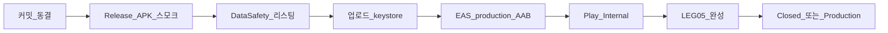

# Play 스토어 본격 테스트 · 게시 준비 QA

| 항목 | 내용 |
|------|------|
| 작성 | 2026-08-11 |
| 배포 단계 | 베타·Internal 준비 (Production 전) |
| 관련 | [RELEASE-CHANNELS.md](./RELEASE-CHANNELS.md) · [LEG-05-STORE-LISTING.md](./LEG-05-STORE-LISTING.md) · [PLAY-DATA-SAFETY.md](./PLAY-DATA-SAFETY.md) · [BUILD-APK.md](../BUILD-APK.md) · `eas.json` |

자동화 테스트 러너는 **없습니다.** Play 관련 검증은 **실기기 Release APK** 와 **Internal AAB** 수동 스모크로 합니다. Expo Go·Debug+Metro는 갤러리/ML Kit 네이티브 모듈이 빠져 기준이 아닙니다.



---

## 0. 빌드·설치 (테스터 채널)

```bat
cd C:\VoiceStamp
REM .env 에 EXPO_PUBLIC_KAKAO_REST_KEY 확인
build-apk.bat
adb install -r VoiceStamp.apk
```

| 확인 | 통과 |
|------|------|
| 설정 → 앱 정보 APK 파일명 | 방금 빌드 `VoiceStamp_YYYYMMDD_HHmmss` 와 일치 |
| 패키지 | `com.voicestamp.app` |
| Metro | **불필요** (Release) |

NCP(사업 취합) 사전 점검 (**공개 ncpProbe는 비활성** — 기대 `404 gone`):

```powershell
Invoke-RestMethod -Method POST -Uri "https://voicestamp-gilt.vercel.app/api/project" `
  -ContentType "application/json" -Body '{"action":"ncpProbe"}'
```

취합 PIN은 **신규 6자리**. 수신에서 PIN을 여러 번 틀리면 `too_many_attempts` 안내.
---

## 1. Phase 0 — P0 기능 스모크 (실기기 필수)

동일 커밋의 dated Release APK로 실행. 결과: Pass / Fail / N/A + 빌드 ID·기기·날짜를 아래에 기록.

| # | 영역 | 통과 기준 | 결과 |
|---|------|-----------|------|
| P0-1 | 콜드스타트 | 첫 설치 intro→start→main, 권한 문구 정상 | |
| P0-2 | 카메라 | 촬영 → 저장 모달 → 목록 반영 | |
| P0-3 | 앨범 선택 | 이미지 피커 → 저장 → 목록 | |
| P0-4 | 음성(제목/메모) | ko-KR 인식, 중단 시 크래시 없음 | |
| P0-5 | GPS·학교·Kakao | 근처 학교 **또는** Kakao 장소; 타임아웃 시 앱 유지 | |
| P0-6 | 내보내기 PDF | 생성·공유/열기 | |
| P0-7 | 내보내기 XLSX | 생성·공유/열기 | |
| P0-8 | 내보내기 HWPX | 생성·공유/열기 | |
| P0-9 | 갤러리 저장 | 앨범 표시명·EXIF 기대값 (설정 갤러리 모드 켠 상태) | |
| P0-10 | ML Kit 블러 | 설정 옵트인 → 얼굴/번호 블러 → 목록·내보내기 반영 | |
| P0-11 | 프로젝트 QR | **폰 2대** + Vercel NCP: 생성→참가→업로드→수신함 병합 | |

### P1·정책·성능

| # | 영역 | 통과 기준 | 결과 |
|---|------|-----------|------|
| P1-1 | 딥링크 | `https://voicestamp-gilt.vercel.app/join` / `voicestamp://join` | |
| P1-2 | 웹 정책 URL | `/privacy` `/license` `/help` `/info` HTTPS 200 | |
| P1-3 | 권한 거부 | 카메라·마이크·위치·사진 각각 거부해도 크래시 없이 안내 | |
| P1-4 | 장면·OCR | 설정 켠 뒤 장면 키워드·OCR 초안 (GMS 기기) | |
| P1-5 | HEALTHCHECK | [HEALTHCHECK.md](./HEALTHCHECK.md) A/B/C 회귀 — 촬영→저장→목록→내보내기 체감 | |

**기록란**

| 항목 | 값 |
|------|-----|
| Git 커밋 | |
| APK 빌드 ID | |
| 기기 A / OS | |
| 기기 B / OS | |
| 테스트일 | |
| 테스터 | |

---

## 2. Phase 1 — 서명 · EAS production AAB · versionCode

### 2.1 패키지·키 정책 (확정)

| 항목 | 결정 |
|------|------|
| Play `applicationId` | `com.voicestamp.app` |
| 업로드 keystore | **Play 전용** — `scripts\create-upload-keystore.bat` → `C:\VoiceStamp-secrets\` |
| 테스터 APK 서명 | 로컬 Gradle **debug keystore** 유지 (사이드로드 채널) |
| 업그레이드 | 사이드로드 → Play **불가**(키 다름). Play 전환 시 기존 테스터 앱 삭제 후 Play 설치 |
| 패키지 분리 | `.beta` suffix **사용 안 함** — 채널은 서명·배포처로만 구분 |

### 2.2 Keystore

```bat
cd C:\VoiceStamp
scripts\create-upload-keystore.bat
```

1. 출력 폴더를 암호화 금고·오프라인 디스크에 백업  
2. `eas login`  
3. `eas credentials` → Android → **production** → 업로드 keystore 등록  
4. Play Console에서 **Play App Signing** 사용(권장)

### 2.3 versionCode 정책

| 채널 | 진실 원천 |
|------|-----------|
| Play / EAS production | `eas.json` `cli.appVersionSource: "remote"` + `production.autoIncrement: true` |
| 테스터 APK | `VoiceStamp_YYYYMMDD_HHmmss.apk` 파일명 (`apkBuildLabel`) — `versionCode`와 무관 |
| `app.json` `version` | `1.0.0` (`versionName`) — 스토어 표기용, 필요 시만 수동 상승 |

첫 production 빌드 전(이미 스토어에 올린 적 있으면):

```bash
eas build:version:set -p android
```

이후:

```bash
eas build --profile production --platform android
```

산출물: **AAB** (APK 아님).

### 2.4 Submit (Internal draft)

```bash
eas submit --profile production --platform android
```

`eas.json` `submit.production.android.track` = **`internal`**, `releaseStatus` = **`draft`**.  
콘솔에서 테스터에 공개·승격은 수동 확인 후.

---

## 3. Phase 2 — Internal testing ↔ APK 동등성

**같은 Git 커밋**으로 (1) `build-apk.bat` Release APK (2) `eas build --profile production` AAB → Play Internal 설치.

| # | 확인 | APK | AAB(Internal) | 비고 |
|---|------|-----|---------------|------|
| E1 | 콜드스타트·권한 | | | |
| E2 | 촬영→저장→목록 | | | |
| E3 | 음성 제목/메모 | | | |
| E4 | 위치·장소 라벨 | | | |
| E5 | PDF/XLSX/HWPX | | | |
| E6 | 갤러리 저장 | | | |
| E7 | ML Kit 블러 | | | |
| E8 | 프로젝트 QR(2대) | | | |
| E9 | 설정 APK 라벨 | dated 파일명 | 스토어 빌드는 versionName 위주 — 혼동 금지 | |
| E10 | 서명 | debug | 업로드/Play App Signing | 덮어설치 불가 |

핫픽스: **테스터 APK 먼저** → 동일 커밋 AAB.

---

## 4. Phase 3 — LEG-05 · Production 직전

완료 문서:

- [LEG-05-STORE-LISTING.md](./LEG-05-STORE-LISTING.md) — 스크린샷·스토어 문구
- [PLAY-DATA-SAFETY.md](./PLAY-DATA-SAFETY.md) — Data safety ↔ [PRIVACY.md](./PRIVACY.md)
- [LICENSE-NOTICE.md](./LICENSE-NOTICE.md) — Production 전환 시 배포 단계 「Play」로 갱신

콘솔:

- Content rating / 대상 연령 (만 14세 미만 비대상)
- 개인정보처리방침 URL: `https://voicestamp-gilt.vercel.app/privacy`
- 문의 메일·스토어 연락처
- Internal → Closed(선택) → Production
- 랜딩 Play CTA는 **Production 이후**; dated APK는 베타 채널 유지

---

## 5. Play Console 맞춤 항목

| 항목 | 값 / 조치 |
|------|-----------|
| 패키지 | `com.voicestamp.app` |
| 개인정보 URL | `https://voicestamp-gilt.vercel.app/privacy` |
| Data safety | [PLAY-DATA-SAFETY.md](./PLAY-DATA-SAFETY.md) |
| 권한 문구 | `app.json` plugins (한국어) |
| 민감 권한 | 카메라·마이크·위치·사진 — 목적 일치 확인 |
| `SYSTEM_ALERT_WINDOW` 등 | 매니페스트에 있으면 정당화 또는 제거 검토 |
| 64-bit | arm64 Release / EAS AAB |

---

## 6. 체크리스트 요약 (RELEASE-CHANNELS §5 동기화)

- [x] `eas.json` `production` AAB + `submit` internal draft
- [x] versionCode = EAS remote + autoIncrement 문서화
- [x] 업로드 keystore 생성 스크립트 (`scripts/create-upload-keystore.bat`)
- [x] 패키지·키 정책 문서화 (Play 전용 키 / 테스터 debug 분리)
- [ ] 업로드 keystore **실생성·금고 백업** (운영자)
- [ ] Play App Signing 등록 (운영자)
- [ ] `eas credentials` + production AAB 1회 (운영자)
- [ ] Internal 설치 + §3 동등성 표 (운영자·실기기)
- [ ] Phase 0 P0 표 전수 Pass (운영자·실기기)
- [ ] LEG-05 스크린샷·문구 콘솔 반영
- [ ] Data safety 콘솔 입력
- [ ] `LICENSE-NOTICE` 배포 단계 → Play (Production 당일)
- [ ] Production + 랜딩 Play CTA

특허·법무 비침해 보장 없음. 본 문서는 QA·배포 절차입니다.
